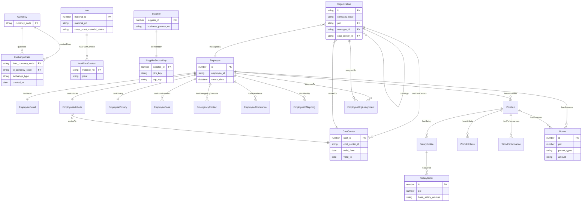

# 巨大機械 Middle Platform — 資料物件設計文件（底層服務域）

> **版本**：2026-07-09
> **依據**：[巨大機械 Middle Platform 設計指南](giant-mdo-platform-design-guideline.txt)
> **來源**：`middle-platform/` 下 5 個既有 Node.js 中台服務原始碼
> **範本**：本文件結構完全依循 [data-object-design-sample](data-object-design-sample.txt)，不自創新結構

---

## 1. 文件概述

### 1.1 目的

本文件依據「巨大機械 Middle Platform 設計指南」的 **Object Type 設計輸出模板**（§4.1.6），對現有 5 個底層中台服務（Cost Center / Exchange Rate / Material / Supplier / Employee）進行資料物件的正規設計。每個 Object Type 皆遵循 MDO 設計鐵律：**資料定義一次、邏輯撰寫一次、存取用設定管理，不在各 App 重複實作**。

現行服務皆為「純讀查詢 + 部分批次寫入」的 Express + PostgreSQL 服務，API input/output 由原始碼（`routes/`、`validation/`、`SQL/`、`docs/swagger`）逐欄擷取而得，見附錄 A。

### 1.2 範圍

涵蓋以下 5 個服務的所有資料模型：

| 服務 | 說明 | 主要資料表 |
|------|------|-----------|
| Cost Center Middle Platform | 成本中心主檔（含有效期） | `cost_center_master`, `cost_center_attribute` |
| Exchange Rate Middle Platform | 匯率（月平均，現值 + 歷史） | `exchange_master`, `exchange_history` |
| Material Middle Platform | 物料主檔（跨廠共通 + 廠別 context） | `material_master`, `material_basic_attribute`, `material_detail`, `material_plant_attribute` |
| Supplier Middle Platform | 供應商（BusinessPartner）+ 新舊系統鍵對應 | `supplier_master`, `supplier_attribute`, `supplier_data_source` |
| Employee Middle Platform | 員工域（含組織、職務、薪資、獎金、對照） | `employee_*`, `work_*`, `salary_*`, `bonus_*`, `organization_m`, `*_mapping*` |

> [!NOTE]
> 各服務中的 `api_key`、`api_auth_routes`、`event_log`、`api_log` 屬於**框架 / 平台基礎設施資料**（認證、路由授權、稽核、請求日誌），非業務需求資料，**不納入**本資料物件設計。認證與稽核以平台共用機制（Auth、audit log）處理，不建模為業務 Object Type。

### 1.3 命名不一致 / 缺陷修正清單

> [!IMPORTANT]
> 以下由原始碼發現的命名與語意問題已在本文件中對外統一，實體欄位名（DB 欄位）遷移期間保留，API response 以別名對外（additive 安全變更）。

| 問題 | 舊寫法（DB / code） | 對外統一寫法（API） | 說明 |
|------|--------------------|--------------------|------|
| 成本中心有效期拼字 | `vaild_from` / `vaild_to` | `validFrom` / `validTo` | 拼字錯誤貫穿 DB/SQL/swagger，保留欄位、API 別名 |
| 獎金型別拼字 | `bouns_types` | `bonusType` | `bonus_m` / `bonus_attribute` 欄位拼字錯誤 |
| 員工姓名國別拼字 | `local_name_coutry` | `localNameCountry` | `employee_attribute` 欄位拼字錯誤 |
| 匯率 created_at 缺文件 | SQL 回 `created_at`，swagger 未列 | `created_at` | 文件補齊 |
| Supplier 巢狀鍵 | `supplier_data_source{plm_key, erp_key}` | `sourceKey{plmKey, erpKey}` | 對外語意化 |
| 錯誤 envelope 不一致 | 驗證用 `errors[]`、DB 用 `error` | 統一 `error{code,message,details,traceId}` | 依指引 §10.7 |
| 組織刪除錯誤碼 | HTTP `500`「請由最底層組織開始刪除」 | `422` | 業務衝突改用 422 |
| 員工刪除阻擋 | HTTP `409` blocking_tables | `422`（precondition） | 依指引 §10.7 |

---

## 2. Object Type 分類總覽

### 2.1 Master Data Objects（共 6 個）

| Object Type | 類別 | 所屬 PBC / 模組 | Database Group | 當前狀態 |
|-------------|------|-----------------|----------------|----------|
| `CostCenter` | Master（含 Configuration 有效期） | Finance / Cost | `finance_commercial` | 純讀，待補寫入 Action |
| `Currency` | Master | Finance | `finance_commercial` | 由匯率欄位正規化出 |
| `Item` | Master（canonical） | Product Master | `product_master` | 純讀，SAP inbound 灌檔 |
| `Supplier` | Master（BusinessPartner） | Product Master（採購域） | `product_master` | 含寫入 |
| `Employee` | Master（aggregate root） | HR Workforce | `hr_workforce`（新增*） | 批次寫入 + event_log |
| `Organization` | Master（階層） | HR / Platform | `platform_core` | 批次寫入 + 擋刪 |

### 2.2 Transaction Data Objects（共 3 個）

| Object Type | 類別 | 所屬 PBC / 模組 | Database Group | 當前狀態 |
|-------------|------|-----------------|----------------|----------|
| `WorkPerformance` | Transaction | HR Workforce | `hr_workforce` | 批次寫入 |
| `EmployeeAttendance` | Transaction | HR Workforce | `hr_workforce` | 批次寫入 |
| `Bonus` | Transaction（polymorphic） | HR Workforce | `hr_workforce` | 批次寫入，`amount` 加密 |

### 2.3 Configuration Data Objects（共 3 個）

| Object Type | 類別 | 所屬 PBC / 模組 | Database Group | 當前狀態 |
|-------------|------|-----------------|----------------|----------|
| `ExchangeRate` | Configuration（時序、可生效） | Finance | `finance_commercial` | 純讀，master + history 雙表 |
| `SalaryDetail` | Configuration | HR Workforce | `hr_workforce` | `base_salary_amount` 加密 |
| `BonusAttribute` | Configuration（暫存/型別條件） | HR Workforce | `hr_workforce` | plaintext amount |

### 2.4 Relationship / Context Objects（共 5 個）

| Object Type | 類別 | 關聯主體 | Database Group | 當前狀態 |
|-------------|------|----------|----------------|----------|
| `ItemPlantContext` | Context Object | `Item`（廠別 context） | `product_master` | 純讀 |
| `SupplierSourceKey` | Relationship | `Supplier`（新舊系統鍵） | `product_master` | 隨 Supplier 寫入 |
| `EmployeeOrgAssignment` | Relationship | `Employee` × `Organization` × `Position` | `hr_workforce` | 單筆寫入 |
| `CompensationMapping` | Relationship（對照） | Workday × application × code | `hr_workforce` | 批次寫入 |
| `SalaryProfile` | Relationship | `Position`（work_m）→ 薪資 | `hr_workforce` | 批次寫入 |

### 2.5 Child Object（Employee aggregate 子物件，共 6 個）

| Object Type | 類別 | 嵌入 / 從屬父物件 | 生命週期關係 | 當前狀態 |
|-------------|------|------------------|-------------|----------|
| `EmployeeDetail` | Child（1:1） | `Employee` | 隨父建立 | 批次寫入 |
| `EmployeeAttribute` | Child（1:1） | `Employee` | 隨父建立 | 批次寫入 |
| `EmployeePrivacy` | Child（1:1, PII） | `Employee` | 隨父建立，**14 欄 AES** | 批次寫入 |
| `EmployeeBank` | Child（1:N, PII） | `Employee` | **7 欄 AES** | 批次寫入 |
| `EmergencyContact` | Child（1:N） | `Employee` | — | 批次寫入 |
| `EmployeeIdMapping` | Child（1:N, source key） | `Employee` | per `source_application` | 批次寫入 |
| `Position`（Work） | Child（1:N） | `Employee` | 職務 | 批次寫入 |
| `WorkAttribute` | Child（1:1 per work） | `Position` | 職務屬性 | 批次寫入 |

> 註：`Position`（對應 `work_m`）兼具被 `SalaryProfile`、`WorkAttribute`、`Bonus(02)` 引用的身份，故列為具身份的 Child Object。

### 2.6 Event / Log Objects（共 1 個）

| Object Type | 類別 | 所屬 | Database Group | 當前狀態 |
|-------------|------|------|----------------|----------|
| `ExchangeRateHistory` | Event（不可變匯率歷史） | Finance | `finance_commercial` | 已實作（`exchange_history`） |

> 框架資料 `event_log`、`api_log`、`api_key`、`api_auth_routes` 不列為業務 Object Type（見 §1.2 說明）。

---

## 3. 每個 Object Type 的詳細設計

---

### 3.1 CostCenter（成本中心主檔）

```
Object Type:
  name: CostCenter
  category: Master（含 Configuration 性質的有效期）
  owner PBC / module: Finance / Cost PBC
  source of truth: ERP 成本中心主檔（未來 inbound sync）
  consumers: Employee(employee_attribute.cost_center_code) / Organization(cost_center_id) / Costing / SuperBOM
  tenant scope:
    enterpriseId required: yes（新增；現況無）
    gsc / organization scope: company_code 轉為業務 scope
  lifecycle:
    statuses: 以 validFrom / validTo 有效期表達（無明確 status 欄）
    create/update/retire Actions: UpsertCostCenter
```

**Fields:**

| 欄位名 | 型別 | 必填 | 選項 | 預設值 | 索引原因 |
|--------|------|:----:|------|--------|----------|
| cost_id | number | ✓ | — | — | PK（系統識別碼） |
| cost_center_id | text | ✓ | — | — | 業務碼，查詢鍵 |
| profit_center | text | △ | — | — | — |
| functional_area | text | △ | — | — | — |
| cost_center_name | text | △ | — | — | 顯示 |
| valid_from | date | ✓ | — | — | 有效期起（DB 欄名 `vaild_from`） |
| valid_to | date | ✓ | — | — | 有效期迄（DB 欄名 `vaild_to`） |
| cost_center_category | text | △ | — | — | 分類 |
| company_code | text | △ | — | — | 業務 scope |
| enterpriseId | text | ✓ | — | — | 租戶隔離（新增） |

**Links:**

| 名稱 | 目標 Object | 基數 | 反向名 | 業務意義 |
|------|------------|------|--------|----------|
| belongsToCompany | Organization | many-to-one | hasCostCenters | 成本中心所屬公司 |

**Functions:**
- `resolveCostCenterAtDate(cost_center_id, at)` — 取代現行 `by_date` 的 `$1 BETWEEN vaild_from AND vaild_to` 邏輯
- `checkCostCenterExists(cost_center_id)` — 取代 `check_existence`

**Actions:**
- `UpsertCostCenter` — precondition: 有效期不重疊 / audit: 記錄異動 / compensation: reverse edit / idempotencyKey: `erpReferenceNumber` / integration: SAP inbound

**Integrations:**
- SAP inbound（`RECEIVED → STAGED → MAPPED → APPLIED`）

**Storage:**
- database group: `finance_commercial`

**Contract:**
- API endpoints: `GET /api/cost_center/attribute`、`GET /api/cost_center/by_date`、`GET /api/cost_center/check_existence`（保留為 v1 read）
- consumer declarations: Costing / SuperBOM / Employee

**Migration:**
- 現行 3 個 GET 保留為 v1 read API；新增 `enterprise_id` nullable → backfill → not null
- 保留 `vaild_from/vaild_to` 實體欄位，API 以 `validFrom/validTo` 別名對外（additive）
- 現行 `SQL/cost_center/update/update_cost_center_attribute.sql` 有 param-shift（`$3` 重複）與逗號語法錯誤且未掛路由 → 廢棄，改由 `UpsertCostCenter` Action 取代

---

### 3.2 Currency（幣別主檔）

```
Object Type:
  name: Currency
  category: Master
  owner PBC / module: Finance
  source of truth: 由匯率 from_/to_currency_code 正規化出獨立主檔
  consumers: ExchangeRate / Costing / SuperBOM
  tenant scope:
    enterpriseId required: no（全域共用）
    gsc / organization scope: 全域
  lifecycle:
    statuses: active / inactive
    create/update/retire Actions: SeedCurrency / UpdateCurrency
```

**Fields:**

| 欄位名 | 型別 | 必填 | 選項 | 預設值 | 索引原因 |
|--------|------|:----:|------|--------|----------|
| currency_code | text | ✓ | — | — | PK 語意，ISO 4217 |
| name | text | △ | — | — | 幣別名稱 |
| minor_unit | number | △ | — | — | 小數位數 |

**Links:**

| 名稱 | 目標 Object | 基數 | 反向名 | 業務意義 |
|------|------------|------|--------|----------|
| quotedFrom | ExchangeRate | one-to-many | fromCurrency | 作為來源幣別的匯率 |
| quotedTo | ExchangeRate | one-to-many | toCurrency | 作為目標幣別的匯率 |

**Storage:**
- database group: `finance_commercial`

**Migration:**
- 現行無獨立幣別主檔；由 `exchange_master.from_currency_code / to_currency_code` 去重萃取建立

---

### 3.3 ExchangeRate（匯率）

```
Object Type:
  name: ExchangeRate
  category: Configuration（時序、可生效、不可變歷史）
  owner PBC / module: Finance
  source of truth: 外部匯率來源（月平均）
  consumers: Costing / SuperBOM / 訂單與發票金額換算
  tenant scope:
    enterpriseId required: yes（現況全域 → 集團預設值 + enterprise 可覆寫）
    gsc / organization scope: 全域可覆寫
  lifecycle:
    statuses: 以 exchange_type + created_at 期別表達
    create/update/retire Actions: ImportExchangeRates
```

**Fields:**

| 欄位名 | 型別 | 必填 | 選項 | 預設值 | 索引原因 |
|--------|------|:----:|------|--------|----------|
| from_currency_code | text | ✓ | — | — | FK → Currency，配對查詢 |
| to_currency_code | text | ✓ | — | — | FK → Currency，配對查詢 |
| from_exchange_amount | number | ✓ | — | — | 來源金額 |
| to_exchange_amount | number | ✓ | — | — | 目標金額 |
| exchange_type | select | ✓ | `MONTH_AVERAGE_RATE` / …(其他型別) | — | 現行僅查月平均 |
| created_at | date | ✓ | — | now() | 期別，`YYYY-MM-DD`，時序查詢 |
| enterpriseId | text | △ | — | — | 覆寫用（新增） |

**Links:**

| 名稱 | 目標 Object | 基數 | 反向名 | 業務意義 |
|------|------------|------|--------|----------|
| fromCurrency | Currency | many-to-one | quotedFrom | 來源幣別 |
| toCurrency | Currency | many-to-one | quotedTo | 目標幣別 |

**Functions:**
- `getExchangeRate(from, to, at?)` — 取代 `by_month_average`（單表 `exchange_master`，`exchange_type='MONTH_AVERAGE_RATE'`）
- `listExchangeRatesByDate(start_at, end_at)` — 取代 `by_date_and_month_average`（`exchange_history` ∪ `exchange_master`，`created_at BETWEEN`）

**Actions:**
- `ImportExchangeRates` — inbound sync / idempotencyKey: `from+to+type+period` / precondition: 幣別存在

**Integrations:**
- 外部匯率 connector（inbound）

**Storage:**
- database group: `finance_commercial`
- `exchange_master`（現值 live）+ `exchange_history`（append-only，標記 Event/immutable）雙表保留

**Migration:**
- 現行 `by_date_and_month_average` 以 `UNION` 合併 history + master，遷移後由 `listExchangeRatesByDate` Function 封裝
- 現行 `validation/exchange/createCurrencyValidation.js` / `updateCurrencyValidation.js` 實為 Supplier 欄位殘留死碼 → 刪除，改以 `ImportExchangeRates` Action 重建

---

### 3.4 Item（物料主檔 — canonical）

```
Object Type:
  name: Item
  category: Master
  owner PBC / module: Product Master
  source of truth: SAP 物料主檔（inbound）
  consumers: Service / Costing / SuperBOM / Rental（canonical，取代散落的 Part/ServicePart/CostPart）
  tenant scope:
    enterpriseId required: yes（多屬集團層共享，用於存取控制與未來多法人）
    gsc / organization scope: plant（見 ItemPlantContext）
  lifecycle:
    statuses: cross_plant_material_status
    create/update/retire Actions: UpsertItemFromSap
```

**Fields（cross-plant 共通，來源 `material_master ⋈ material_basic_attribute`）:**

| 欄位名 | 型別 | 必填 | 選項 | 預設值 | 索引原因 |
|--------|------|:----:|------|--------|----------|
| material_id | number | ✓ | — | — | PK |
| material_no | text | ✓ | — | — | 業務碼，查詢鍵 |
| material_type | text | △ | — | — | SAP 物料類型 |
| material_item | text | △ | — | — | — |
| material_group_no | text | △ | — | — | — |
| material_group_description | text | △ | — | — | — |
| material_inventory_unit | text | △ | — | — | 庫存單位 |
| material_base_unit | text | △ | — | — | 基本單位 |
| material_hierarchy | text | △ | — | — | 產品階層 |
| model_name | text | △ | — | — | 車型 |
| is_giip | boolean | △ | — | — | — |
| authorization_group | text | △ | — | — | — |
| old_material_no | text | △ | — | — | 舊料號 |
| cross_plant_material_status | text | △ | — | — | 跨廠物料狀態 |
| net_weight | number | △ | — | — | 淨重 |
| gross_weight | number | △ | — | — | 毛重 |
| volume | number | △ | — | — | 體積 |
| weight_unit | text | △ | — | — | 重量單位 |
| volume_unit | text | △ | — | — | 體積單位 |
| material_description | textarea | △ | — | — | 長描述（來源 `material_detail`） |
| enterpriseId | text | ✓ | — | — | 租戶隔離（新增） |

**Links:**

| 名稱 | 目標 Object | 基數 | 反向名 | 業務意義 |
|------|------------|------|--------|----------|
| hasPlantContext | ItemPlantContext | one-to-many | contextOfItem | 廠別 context |

**Functions:**
- `getItemCommon(material_no)` — 取代 `GET /api/material/attribute/common`
- `getItemWithPlant(material_no, plant)` — 取代 `GET /api/material/attribute/all`
- `listItemsChangedBetween(start, end)` — 取代 `GET /api/material/by_date/*`（`created_at`/`changed_at` OR 條件）

**Actions:**
- `UpsertItemFromSap` — inbound / erpStatus/erpReferenceNumber/erpSyncAt / idempotencyKey: `material_no+changed_at`

**Integrations:**
- SAP material master（inbound；staging + mapping template）

**Storage:**
- database group: `product_master`

**Migration:**
- 現行純讀，寫入僅發生於灌檔；遷移後所有寫入走 `UpsertItemFromSap` Action
- `by_date` OR 條件現行只比對 master 的 `created_at`（漏 `M.changed_at`）→ 遷移時補齊增量抓取

---

### 3.5 ItemPlantContext（物料廠別 context）

```
Object Type:
  name: ItemPlantContext
  category: Context Object（指引 §4.1.5）
  owner PBC / module: Product Master
  source of truth: SAP 物料廠別資料（inbound）
  consumers: 採購 / 庫存 / 生產
  tenant scope:
    enterpriseId required: yes
    gsc / organization scope: plant
  lifecycle:
    statuses: plant_material_status
    create/update/retire Actions: UpsertItemFromSap（同 Item inbound）
```

**Fields（來源 `material_plant_attribute`）:**

| 欄位名 | 型別 | 必填 | 選項 | 預設值 | 索引原因 |
|--------|------|:----:|------|--------|----------|
| material_no | text | ✓ | — | — | FK → Item |
| plant | text | ✓ | — | — | 廠別 scope key |
| plant_no | text | △ | — | — | — |
| plant_material_status | text | △ | — | — | 廠別物料狀態 |
| is_purchase | boolean | △ | — | — | 是否採購 |
| commodity_code | text | △ | — | — | 商品碼 |
| country_of_origin | text | △ | — | — | 原產國 |
| purchase_group | text | △ | — | — | 採購群組 |
| stock_group | text | △ | — | — | 庫存群組 |
| mrp_controller | text | △ | — | — | MRP 控制者 |
| procurement_type | text | △ | — | — | 採購類型 |
| special_procurement_type | text | △ | — | — | 特殊採購類型 |
| effectiveFrom | date | △ | — | — | 有效期起（新增） |
| effectiveTo | date | △ | — | — | 有效期迄（新增） |

**Links:**

| 名稱 | 目標 Object | 基數 | 反向名 | 業務意義 |
|------|------------|------|--------|----------|
| contextOfItem | Item | many-to-one | hasPlantContext | 所屬物料 |

**Storage:**
- database group: `product_master`

> [!NOTE]
> 現行 `attribute/all` 與 `by_date/all` 以 INNER JOIN `material_plant_attribute`，會濾掉「無廠別資料」的物料；且 `by_date/all` 無 plant 過濾，同一物料依 plant 展開多列。遷移時於 resolver Function 明確化此語意。

---

### 3.6 Supplier（供應商 / BusinessPartner）

```
Object Type:
  name: Supplier
  category: Master
  owner PBC / module: Product Master（採購域）
  source of truth: PLM(舊) ↔ SAP/ERP(新)
  consumers: 採購 / 訂單 / 品質
  tenant scope:
    enterpriseId required: yes
    gsc / organization scope: 集團層共享
  lifecycle:
    statuses: active（無明確狀態欄）
    create/update/retire Actions: RegisterSupplier / UpdateSupplierAttributes
```

**Fields（來源 `supplier_attribute`）:**

| 欄位名 | 型別 | 必填 | 選項 | 預設值 | 索引原因 |
|--------|------|:----:|------|--------|----------|
| supplier_id | number | ✓ | — | — | PK（`supplier_master` 產生） |
| business_partner_no | text | △ | — | — | ERP 鍵（= erp_key），查詢鍵 |
| gcm_code | text | △ | — | — | 6 碼查詢鍵之一 |
| gck_code | text | △ | — | — | 6 碼查詢鍵之一 |
| gev_code | text | △ | — | — | 6 碼查詢鍵之一 |
| gct_code | text | △ | — | — | 6 碼查詢鍵之一 |
| gtm_code | text | △ | — | — | 6 碼查詢鍵之一 |
| brief_chinese | text | △ | — | — | 中文簡稱 |
| brief_english | text | △ | — | — | 英文簡稱 |
| fullname_chinese | text | △ | — | — | 中文全名 |
| fullname_english | text | △ | — | — | 英文全名 |
| phone | text | △ | — | — | — |
| address | text | △ | — | — | — |
| enterpriseId | text | ✓ | — | — | 租戶隔離（新增） |

> 可查詢鍵（fan-out）：`gcm_code / gck_code / gev_code / gct_code / gtm_code / business_partner_no`。

**Links:**

| 名稱 | 目標 Object | 基數 | 反向名 | 業務意義 |
|------|------------|------|--------|----------|
| identifiedBy | SupplierSourceKey | one-to-one | identifies | 新舊系統鍵對應 |

**Functions:**
- `findSupplierByKey(search_key)` — 取代 `GET /api/supplier/attribute`（6 碼 OR fan-out）
- `checkSupplierExists(search_key)` — 取代 `GET /api/supplier/check_existence`
- `listSuppliersCreatedSince(created_at)` — 取代 `GET /api/supplier/by_datetime`（incremental sync）

**Actions:**
- `RegisterSupplier` — 取代現行 `POST /api/supplier` 的 search-then-upsert：precondition: `plm_key` 或 `business_partner_no` 至少一；conflict: `erp_key` 不一致 → 409；idempotencyKey: `plm_key|business_partner_no`；integration event: 綁定新舊系統。命中數決策：0 → 建立(201) / 1 且 erp 一致 → 綁定更新(200) / ≥2 或衝突 → 409
- `UpdateSupplierAttributes` — 取代現行 `PUT /api/supplier/attribute`：批次；欄位級清空語意（傳入 `""`/`null` 清空）；`business_partner_no` 同步 `erp_key`；audit 進 `event_log`

**Integrations:**
- PLM(legacy) ↔ SAP/ERP(new) 雙向對應

**Storage:**
- database group: `product_master`

**Migration:**
- 現行 `create.js` 的 6 分支 search 策略 → 收斂為 `findSupplierByKey` Function + `RegisterSupplier` Action
- `SQL/supplier/update/*.sql`、`SQL/supplier/attribute/update_supplier_attribute.sql` 為死碼（route 用 inline SQL，且空值語意相反）→ 刪除
- PUT 批次更新現行每列各自 `BEGIN/COMMIT`（非原子）→ 遷移為單一交易 + per-row 補償

---

### 3.7 SupplierSourceKey（供應商新舊系統鍵對應）

```
Object Type:
  name: SupplierSourceKey
  category: Relationship（指引 §4.1.3）
  owner PBC / module: Product Master（採購域）
  source of truth: 綁定 PLM 與 ERP
  consumers: Supplier 整合
  tenant scope:
    enterpriseId required: yes
    gsc / organization scope: 集團層
  lifecycle:
    statuses: 不適用
    create/update/retire Actions: 隨 RegisterSupplier / UpdateSupplierAttributes
```

**Fields（來源 `supplier_data_source`）:**

| 欄位名 | 型別 | 必填 | 選項 | 預設值 | 索引原因 |
|--------|------|:----:|------|--------|----------|
| supplier_id | number | ✓ | — | — | FK → Supplier |
| plm_key | text | △ | — | — | legacy PLM 鍵 |
| erp_key | text | △ | — | — | SAP/ERP 鍵（= business_partner_no） |

**Links:**

| 名稱 | 目標 Object | 基數 | 反向名 | 業務意義 |
|------|------------|------|--------|----------|
| identifies | Supplier | one-to-one | identifiedBy | 對應的供應商 |

**Storage:**
- database group: `product_master`

---

### 3.8 Employee（員工主檔 — aggregate root）

```
Object Type:
  name: Employee
  category: Master（aggregate root）
  owner PBC / module: HR Workforce
  source of truth: 中台（未來 Workday inbound）
  consumers: HR portal / 組織 / 薪資 / 獎金
  tenant scope:
    enterpriseId required: yes
    gsc / organization scope: company_code 業務 scope
  lifecycle:
    statuses: employee_attribute.terminated / termination_date
    create/update/retire Actions: CreateEmployees / DeleteEmployee
```

**Fields（`employee_m`）:**

| 欄位名 | 型別 | 必填 | 選項 | 預設值 | 索引原因 |
|--------|------|:----:|------|--------|----------|
| id | number | ✓ | — | — | PK（子表 pid 關聯） |
| employee_id | text | ✓ | — | — | 業務碼（自然鍵，去重），查詢鍵 |
| create_date | datetime | ✓ | — | now() | — |
| enterpriseId | text | ✓ | — | — | 租戶隔離（新增） |

**Links:**

| 名稱 | 目標 Object | 基數 | 反向名 | 業務意義 |
|------|------------|------|--------|----------|
| hasDetail | EmployeeDetail | one-to-one | detailOf | 基本明細 |
| hasAttribute | EmployeeAttribute | one-to-one | attributeOf | 屬性 |
| hasPrivacy | EmployeePrivacy | one-to-one | privacyOf | PII |
| hasBankAccounts | EmployeeBank | one-to-many | ownedBy | 銀行帳戶 |
| hasEmergencyContacts | EmergencyContact | one-to-many | contactOf | 緊急聯絡人 |
| hasAttendance | EmployeeAttendance | one-to-many | attendanceOf | 出勤 |
| identifiedBy | EmployeeIdMapping | one-to-many | mapsEmployee | 來源系統鍵 |
| holdsPosition | Position | one-to-many | heldBy | 職務 |
| assignedTo | Organization | many-to-one（via EmployeeOrgAssignment） | hasMembers | 組織指派 |
| manages | Organization | one-to-many | managedBy | 擔任主管的組織 |

**Functions:**
- 各實體 GET → resource query（多值 CSV → `IN` 篩選）

**Actions:**
- `CreateEmployees` — 批次；自然鍵 `employee_id` 去重
- `DeleteEmployee` — precondition: 無子表參照（`emergency_contact / employee_attendance / employee_attribute / employee_bank / employee_detail / employee_id_mapping / employee_privacy / bonus_m` 以 `pid`；`work_m` 以 `employee_id`），否則回 `blocking_tables`（現況 409 → 改 422）；compensation: `event_log` 快照

**Integrations:**
- 未來 Workday inbound（`employee_id_mapping` 已是 source key 雛形）

**Storage:**
- database group: `hr_workforce`（新增）

> [!IMPORTANT]
> Employee 域是**唯一已具批次寫 + event_log 稽核**的模組，最接近指引 Action 模型；遷移時把每個批次 POST/PUT/DELETE 正式命名為 Action（加 `idempotencyKey` 與標準錯誤碼），改動最小。

---

### 3.9 EmployeeDetail（員工基本明細，1:1）

```
Object Type:
  name: EmployeeDetail
  category: Child（1:1）
  owner PBC / module: HR Workforce
  source of truth: 中台
  tenant scope: enterpriseId required: yes（隨 Employee）
  lifecycle: create/update/retire Actions: Create/Update/DeleteEmployeeDetail
```

**Fields（`employee_detail`）:**

| 欄位名 | 型別 | 必填 | 選項 | 預設值 | 索引原因 |
|--------|------|:----:|------|--------|----------|
| id | number | ✓ | — | — | PK |
| pid | number | ✓ | — | — | FK → Employee.id（去重鍵） |
| gender | text | △ | — | — | 性別 |
| nationality | text | △ | — | — | 國籍 |

**Links:** `detailOf → Employee (many-to-one, reverseName: hasDetail)`
**Storage:** database group: `hr_workforce`
**Migration:** 移除檔頭誤植的 `const { console } = require('inspector')`（覆寫全域 console 死碼）

---

### 3.10 EmployeeAttribute（員工屬性，1:1）

```
Object Type:
  name: EmployeeAttribute
  category: Child（1:1）
  owner PBC / module: HR Workforce
  source of truth: 中台
  tenant scope: enterpriseId required: yes；company_code / cost_center_code 為業務 scope
  lifecycle: create/update/retire Actions: Create/Update/DeleteEmployeeAttribute
```

**Fields（`employee_attribute`，主要欄位）:**

| 欄位名 | 型別 | 必填 | 選項 | 預設值 | 索引原因 |
|--------|------|:----:|------|--------|----------|
| id | number | ✓ | — | — | PK |
| pid | number | ✓ | — | — | FK → Employee.id（去重鍵） |
| employee_type | text | △ | — | — | — |
| job_category | text | △ | — | — | — |
| work_mail | text | △ | — | — | — |
| en_first_name / en_middle_name / en_last_name | text | △ | — | — | 英文姓名 |
| local_name_country | text | △ | — | — | DB 欄名 `local_name_coutry`（拼字） |
| local_first_name / local_last_name | text | △ | — | — | 本地姓名 |
| ad_account / ad_email | text | △ | — | — | AD 帳號 |
| pay_group | text | △ | — | — | 薪資群組 |
| hire_date | date | △ | — | — | 到職日 |
| termination_date | date | △ | — | — | 離職日 |
| terminated | boolean | △ | — | — | 是否離職 |
| union_membership | text | △ | — | — | 工會 |
| union_membership_start_date / union_membership_end_date | date | △ | — | — | 工會期間 |
| company_code | text | △ | — | — | 業務 scope |
| company_name | text | △ | — | — | — |
| cost_center_code | text | △ | — | — | FK → CostCenter（跨 group 參照） |
| start_date / end_date | date | △ | — | — | 有效期 |

**Links:** `attributeOf → Employee`；`costedTo → CostCenter (many-to-one)`
**Storage:** database group: `hr_workforce`
**Migration:** `local_name_coutry` 保留欄位，API 別名 `localNameCountry`

---

### 3.11 EmployeePrivacy（員工隱私 PII，1:1，14 欄 AES）

```
Object Type:
  name: EmployeePrivacy
  category: Child（1:1, PII）
  owner PBC / module: HR Workforce
  source of truth: 中台
  tenant scope: enterpriseId required: yes；欄位級 AES 加密
  lifecycle: create/update/retire Actions: Create/Update/DeleteEmployeePrivacy
```

**Fields（`employee_privacy`）:**

| 欄位名 | 型別 | 必填 | 加密 | 說明 |
|--------|------|:----:|:----:|------|
| id | number | ✓ | — | PK |
| pid | number | ✓ | — | FK → Employee.id |
| birthday | text | △ | 🔒 | 生日 |
| birth_country / birth_city | text | △ | 🔒 | 出生地 |
| marital_status | text | △ | 🔒 | 婚姻 |
| national_id_value / national_country | text | △ | 🔒 | 身分證 |
| passport_country / passport_type / passport_id | text | △ | 🔒 | 護照 |
| visa_country / visa_id_type / visa_id | text | △ | 🔒 | 簽證 |
| arc_value / arc_country | text | △ | 🔒 | 居留證 |
| national_start_date / national_end_date | date | △ | — | 身分證有效期 |
| passport_start_date / passport_end_date | date | △ | — | 護照有效期 |
| visa_start_date / visa_end_date | date | △ | — | 簽證有效期 |
| arc_start_date / arc_end_date | date | △ | — | 居留證有效期 |

> 🔒 = AES-256-CBC 加密（共 **14 欄**）；8 個日期欄位為明文，寫入前做 `YYYY-MM-DD` 格式與 end ≥ start 配對驗證。

**Links:** `privacyOf → Employee`
**Storage:** database group: `hr_workforce`
**Migration:** GET 解密失敗時現行靜默回傳密文 → 改為錯誤處理，避免密文外洩

---

### 3.12 EmployeeBank（員工銀行帳戶，1:N，7 欄 AES）

**Fields（`employee_bank`）:**

| 欄位名 | 型別 | 必填 | 加密 | 說明 |
|--------|------|:----:|:----:|------|
| id | number | ✓ | — | PK |
| pid | number | ✓ | — | FK → Employee.id |
| country | text | △ | 🔒 | 國別 |
| account_number | text | △ | 🔒 | 帳號 |
| bank_name | text | △ | 🔒 | 銀行名 |
| bic | text | △ | 🔒 | SWIFT/BIC |
| account_name | text | △ | 🔒 | 戶名 |
| branch_name | text | △ | 🔒 | 分行名 |
| branch_code | text | △ | 🔒 | 分行代碼 |

> 🔒 = AES 加密（共 **7 欄**）。**Links:** `ownedBy → Employee (many-to-one, reverseName: hasBankAccounts)`。**Storage:** `hr_workforce`。

---

### 3.13 EmergencyContact（緊急聯絡人，1:N）

**Fields（`emergency_contact`）:** `id`(PK), `pid`(FK→Employee.id), `contact_name`, `relationship`, `primary_phone`, `primary_address`。
**Links:** `contactOf → Employee (many-to-one, reverseName: hasEmergencyContacts)`。**Storage:** `hr_workforce`。

---

### 3.14 EmployeeAttendance（員工出勤，1:N，Transaction）

**Fields（`employee_attendance`）:** `id`(PK), `pid`(FK→Employee.id), `types`, `start_date`, `end_date`, `reason`, `hour_amount`。
**Links:** `attendanceOf → Employee`。**Storage:** `hr_workforce`。
**Migration:** POST/PUT 現行**無日期驗證**（僅 GET 有）→ 補齊；GET end-only 過濾誤用 `start_date <= end` → 修正。

---

### 3.15 EmployeeIdMapping（員工來源系統鍵，1:N）

**Fields（`employee_id_mapping`）:** `id`(PK), `pid`(FK→Employee.id), `source_application`, `employee_code`, `create_date`。唯一鍵 `pid + source_application`。
**Links:** `mapsEmployee → Employee`。**Storage:** `hr_workforce`。

---

### 3.16 Position（職務，work_m，Child）

**Fields（`work_m`）:** `id`(PK), `employee_id`(FK→Employee.employee_id), `types`。
**Links:** `heldBy → Employee (many-to-one, reverseName: holdsPosition)`；被 `SalaryProfile`、`WorkAttribute`、`Bonus(02)`、`WorkPerformance` 引用。
**Storage:** `hr_workforce`。

---

### 3.17 WorkAttribute（職務屬性）

**Fields（`work_attribute`）:** `id`(PK), `pid`(FK→work_m 或 Employee), `position_title`, `business_title`, `manager_employee_id`(FK→Employee), `start_date`, `end_date`, `job_skills_code`, `job_skills_title`。
**Storage:** `hr_workforce`。

---

### 3.18 WorkPerformance（績效，Transaction）

**Fields（`work_performance`）:** `id`(PK), `pid`(FK→work_m), `review_year`(1900..當年+1), `review_result`, `start_date`, `end_date`。
**Storage:** `hr_workforce`。
**Migration:** 修正 `uplicateCount` 拼字（隱式全域）與 `dataCount` 未宣告全域洩漏。

---

### 3.19 SalaryProfile（薪資檔，salary_m，Relationship）

**Fields（`salary_m`）:** `id`(PK), `work_id`(FK→work_m)。
**Links:** `salaryOf → Position (many-to-one)`。**Storage:** `hr_workforce`。

---

### 3.20 SalaryDetail（薪資明細，Configuration，base_salary_amount AES）

**Fields（`salary_detail`）:**

| 欄位名 | 型別 | 必填 | 加密 | 說明 |
|--------|------|:----:|:----:|------|
| id | number | ✓ | — | PK |
| pid | number | ✓ | — | FK |
| grade_id | text | △ | — | 職等 |
| profile_id | text | △ | — | FK → SalaryProfile |
| pay_range_maximum / pay_range_minimum | number | △ | — | 薪幅 |
| base_salary_plan | text | △ | — | — |
| base_salary_start_date | date | △ | — | — |
| base_salary_amount | text | △ | 🔒 | **底薪（AES 加密）** |
| base_salary_frequency | text | △ | — | — |
| base_salary_currency | text | △ | — | FK → Currency |
| period_salary_plan | text | △ | — | — |

**Storage:** `hr_workforce`。
**Migration:** 修正 POST 以 `detail.pid` 誤驗 `salary_m`（應為 `profile_id`）。

---

### 3.21 Bonus（獎金，bonus_m，Transaction，polymorphic，amount AES）

```
Object Type:
  name: Bonus
  category: Transaction（polymorphic）
  owner PBC / module: HR Workforce
  lifecycle: create/update Actions: Create/Update/DeleteBonus
```

**Fields（`bonus_m`）:**

| 欄位名 | 型別 | 必填 | 加密 | 選項 | 說明 |
|--------|------|:----:|:----:|------|------|
| id | number | ✓ | — | — | PK |
| pid | number | ✓ | — | — | **polymorphic FK** |
| parent_types | select | ✓ | — | `01`(員工→employee_m) / `02`(職務→work_m) | 決定 pid 指向哪個父表 |
| bonus_type | select | ✓ | — | `01` / `02`（DB 欄名 `bouns_types`） | `02` 時 `pay_date` 必填 |
| bonus_title | text | △ | — | — | — |
| amount | text | ✓ | 🔒 | — | **金額（AES 加密）** |
| currency | text | △ | — | — | FK → Currency |
| effective_date / end_date | date | ✓ | — | — | end ≥ effective |
| pay_date | date | △ | — | — | `bonus_type=02` 必填 |
| create_date | datetime | ✓ | — | — | now() |

**Links:** `bonusFor → Employee | Position (many-to-one, polymorphic, reverseName: hasBonuses)`
**Storage:** `hr_workforce`。
**Migration:** PUT 不重驗 polymorphic parent → 補齊；`bouns_types` 保留欄位、API 別名 `bonusType`。

---

### 3.22 BonusAttribute（獎金屬性/暫存，Configuration，plaintext amount）

**Fields（`bonus_attribute`）:** `id`(PK), `pid`(FK→bonus_m), `bonus_title`, `amount`(**明文**，異於 bonus_m), `currency`, `effective_date`, `end_date`, `pay_date`, `create_date`。
**Storage:** `hr_workforce`。
**Migration:** 檔名 `bonus_attribute_discard_and_save_temporarily.js` 誤導 → 正名；型別條件驗證讀 `bonus_m.types`（實為 `parent_types`/`bouns_types`）永遠 undefined → 修正欄位名。

---

### 3.23 Organization（組織主檔，階層）

```
Object Type:
  name: Organization
  category: Master（階層）
  owner PBC / module: HR / Platform（identity/organization）
  source of truth: 中台（未來 Workday）
  consumers: Employee / CostCenter / HR
  tenant scope:
    enterpriseId required: yes
    gsc / organization scope: company_code 業務 scope
  lifecycle:
    statuses: inactive（soft-delete flag）
    create/update/retire Actions: CreateOrganizations / UpdateOrganizations / DeleteOrganization
```

**Fields（`organization_m`）:**

| 欄位名 | 型別 | 必填 | 選項 | 預設值 | 索引原因 |
|--------|------|:----:|------|--------|----------|
| id | text | ✓ | — | UUID | PK |
| company_code | text | △ | — | — | 業務 scope，查詢鍵 |
| company_name | text | △ | — | — | 查詢鍵 |
| name | text | △ | — | — | 組織名，查詢鍵 |
| sub_type_id / sub_type | text | △ | — | — | 子類型 |
| hr_partner | text | △ | — | — | — |
| inactive | boolean | △ | — | — | soft-delete flag |
| cost_center_id | text | △ | — | — | FK → CostCenter（跨 group） |
| manager_id | text | △ | — | — | FK → Employee.id |
| pid | text | △ | — | — | FK → Organization.id（自參照，支援 null 查詢） |
| workday_id | text | △ | — | — | 查詢鍵 |
| start_date / end_date | date | △ | — | — | 有效期 |

**Links:**

| 名稱 | 目標 Object | 基數 | 反向名 | 業務意義 |
|------|------------|------|--------|----------|
| parentOrg | Organization | many-to-one | childOrgs | 上層組織（pid 自參照） |
| managedBy | Employee | many-to-one | manages | 主管 |
| costedTo | CostCenter | many-to-one | hasOrgs | 成本中心 |

**Actions:**
- `CreateOrganizations` / `UpdateOrganizations`（批次）— precondition: `pid` 與 `manager_id` 存在性驗證
- `DeleteOrganization` — precondition: 無子節點（`pid = id`），否則現況回 HTTP 500「請由最底層組織開始刪除」→ **改標準 422**；compensation: `event_log` 快照

**Storage:**
- database group: `platform_core`

---

### 3.24 EmployeeOrgAssignment（員工組織指派，Relationship）

**Fields（`employee_mapping_organization`）:** `id`(PK), `employee_id`(FK→Employee), `organization_id`(FK→Organization), `work_id`(FK→work_m), `start_date`, `create_date`。
**Links:** `assignedTo → Organization`；`holdsPosition → Position`。**Storage:** `hr_workforce`。
**Migration:** 現行 POST 為單筆但保留批次骨架（`empty/duplicate` 恒 0）；`@tablename` 字串模板 → 改參數化白名單；DELETE 誤引不存在的 `deletedData.pid`。

---

### 3.25 CompensationMapping（薪酬對照，Relationship）

**Fields（`compensation_mapping`）:** `id`(PK), `workday_code`, `application_name`, `code`。唯一組合 `workday_code + application_name + code`。
**Storage:** `hr_workforce`。

---

> **框架資料排除**：`api_key`、`api_auth_routes`、`event_log`、`api_log` 為平台認證、路由授權、稽核與請求日誌的**基礎設施資料**，非業務需求資料，不建模為 Object Type。其中認證（Auth / JWT）、路由授權（RBAC）、audit log 屬平台共用能力（見設計指南 §11 Auth / §10 Contract），以平台層統一提供；Action 的 audit 需求沿用既有稽核機制，但不需將 `event_log` 表本身列為業務物件。

---

## 4. Link Types 定義（語意關聯）

| Source | → Target | Name | Cardinality | reverseName | 現行對應 |
|--------|----------|------|-------------|-------------|----------|
| CostCenter | → Organization | belongsToCompany | many-to-one | hasCostCenters | `company_code` |
| ExchangeRate | → Currency | fromCurrency | many-to-one | quotedFrom | `from_currency_code` |
| ExchangeRate | → Currency | toCurrency | many-to-one | quotedTo | `to_currency_code` |
| Item | → ItemPlantContext | hasPlantContext | one-to-many | contextOfItem | `material_id` FK |
| Supplier | → SupplierSourceKey | identifiedBy | one-to-one | identifies | `supplier_id` FK |
| Employee | → EmployeeDetail | hasDetail | one-to-one | detailOf | `pid` |
| Employee | → EmployeeAttribute | hasAttribute | one-to-one | attributeOf | `pid` |
| Employee | → EmployeePrivacy | hasPrivacy | one-to-one | privacyOf | `pid` |
| Employee | → EmployeeBank | hasBankAccounts | one-to-many | ownedBy | `pid` |
| Employee | → EmergencyContact | hasEmergencyContacts | one-to-many | contactOf | `pid` |
| Employee | → EmployeeAttendance | hasAttendance | one-to-many | attendanceOf | `pid` |
| Employee | → EmployeeIdMapping | identifiedBy | one-to-many | mapsEmployee | `pid + source_application` |
| Employee | → Position | holdsPosition | one-to-many | heldBy | `work_m.employee_id` |
| Employee | → Organization | assignedTo | many-to-one（via EmployeeOrgAssignment） | hasMembers | `employee_mapping_organization` |
| Position | → SalaryProfile | hasSalary | one-to-many | salaryOf | `salary_m.work_id` |
| SalaryProfile | → SalaryDetail | hasDetail | one-to-many | detailOf | `profile_id` |
| Bonus | → Employee \| Position | bonusFor | many-to-one（poly） | hasBonuses | `parent_types + pid` |
| WorkAttribute | → Position | describesPosition | many-to-one | hasAttribute | `pid` |
| WorkPerformance | → Position | reviewsPosition | many-to-one | hasPerformances | `pid` |
| Organization | → Organization | parentOrg | many-to-one | childOrgs | `pid` 自參照 |
| Organization | → Employee | managedBy | many-to-one | manages | `manager_id` |
| Organization | → CostCenter | costedTo | many-to-one | hasOrgs | `cost_center_id` |
| EmployeeAttribute | → CostCenter | costedTo | many-to-one | — | `cost_center_code` |

---

## 5. Database Group 規劃

依據 MDO 設計指南 §8 的 database groups（依 bounded business lifecycle 拆）：

### 5.1 `platform_core`

> identity、organization、auth、platform registry、semantic model、access policy

| Object Type | 對應現行表 |
|-------------|-----------|
| Organization | `organization_m` |

> 認證 / 授權 / 稽核（`api_key`、`api_auth_routes`、`event_log`、`api_log`）為平台框架資料，實體上位於 `platform_core`，但不列為業務 Object Type。

### 5.2 `product_master`

> Item / Part、attribute / configuration、採購 BusinessPartner

| Object Type | 對應現行表 |
|-------------|-----------|
| Item | `material_master`, `material_basic_attribute`, `material_detail` |
| ItemPlantContext | `material_plant_attribute` |
| Supplier | `supplier_master`, `supplier_attribute` |
| SupplierSourceKey | `supplier_data_source` |

### 5.3 `finance_commercial`

> currency、exchange rate、cost、pricing

| Object Type | 對應現行表 |
|-------------|-----------|
| CostCenter | `cost_center_master`, `cost_center_attribute` |
| Currency | （由匯率正規化） |
| ExchangeRate | `exchange_master` |
| ExchangeRateHistory | `exchange_history` |

### 5.4 `hr_workforce`（新增*）

> employee + 子表、職務、薪資、獎金、對照

| Object Type | 對應現行表 |
|-------------|-----------|
| Employee | `employee_m` |
| EmployeeDetail / Attribute / Privacy / Bank | `employee_detail` / `employee_attribute` / `employee_privacy` / `employee_bank` |
| EmergencyContact / EmployeeAttendance / EmployeeIdMapping | `emergency_contact` / `employee_attendance` / `employee_id_mapping` |
| Position / WorkAttribute / WorkPerformance | `work_m` / `work_attribute` / `work_performance` |
| SalaryProfile / SalaryDetail | `salary_m` / `salary_detail` |
| Bonus / BonusAttribute | `bonus_m` / `bonus_attribute` |
| EmployeeOrgAssignment / CompensationMapping | `employee_mapping_organization` / `compensation_mapping` |

> \* **偏離說明**：指引 §8 原列六個 group 未涵蓋 HR/人資領域。本設計新增 `hr_workforce` 作為一個 bounded business lifecycle group，符合指引「依 bounded lifecycle 拆、約六個 group」的**原則**（總數仍在合理範圍）。Organization 依指引歸 `platform_core`。若集團偏好，Supplier 可獨立為 `partner_master`；此處先併入 `product_master` 採購域。

**跨 group 規範（沿用指引 §8）：** 跨 group 不用 DB FK，改 stable ID + API/projection/event。典型跨 group 關係：`Organization.cost_center_id`（platform_core → finance_commercial）、`EmployeeAttribute.cost_center_code`（hr_workforce → finance_commercial）、`Item ↔ Supplier`（product_master 內）→ 皆改為 stable-ID 參照 + resolver Function。

---

## 6. ERP 同步欄位設計

依 MDO 指南 §4.1，需與外部系統同步的 Object Types 必須具備 ERP 同步欄位（現況皆無，屬遷移新增）：

| Object Type | erpStatus | erpReferenceNumber | erpSyncAt | erpLastError | 同步方向 | 來源 |
|-------------|-----------|--------------------|-----------|--------------|----------|------|
| `CostCenter` | ✓ | ERP 成本中心號 | ✓ | ✓ | inbound | ERP |
| `ExchangeRate` | ✓ | 匯率期別鍵 | ✓ | — | inbound | 外部匯率 |
| `Item` | ✓ | SAP Material No | ✓ | ✓ | inbound | SAP |
| `ItemPlantContext` | ✓ | SAP Material+Plant | ✓ | ✓ | inbound | SAP |
| `Supplier` | ✓ | `business_partner_no`(erp_key) | ✓ | ✓ | inbound/outbound | PLM ↔ SAP |
| `Employee` | ✓ | Workday ID（未來） | ✓ | ✓ | inbound（未來） | Workday |

**ERP 同步欄位定義：**

```typescript
interface ErpSyncFields {
  erpStatus: 'PENDING' | 'SYNCING' | 'SYNCED' | 'ERROR' | 'FAILED';
  erpReferenceNumber: string;   // 外部系統文件編號
  erpSyncAt: string;            // 最後同步時間 ISO 8601
  erpLastError?: string;        // 最後同步錯誤訊息
}
```

**ERP 同步狀態流程：**

```text
PENDING → SYNCING → SYNCED
                  → ERROR → RETRY → SYNCED
                                  → FAILED (進 exception queue)
```

---

## 7. 關聯圖（Mermaid ER Diagram）



---

## 附錄 A：Object Type 總數統計

| 分類 | 數量 | Object Types |
|------|:----:|-------------|
| Master | 6 | CostCenter, Currency, Item, Supplier, Employee, Organization |
| Transaction | 3 | WorkPerformance, EmployeeAttendance, Bonus |
| Configuration | 3 | ExchangeRate, SalaryDetail, BonusAttribute |
| Relationship / Context | 5 | ItemPlantContext, SupplierSourceKey, EmployeeOrgAssignment, CompensationMapping, SalaryProfile |
| Child（Employee aggregate） | 8 | EmployeeDetail, EmployeeAttribute, EmployeePrivacy, EmployeeBank, EmergencyContact, EmployeeIdMapping, Position, WorkAttribute |
| Event / Log | 1 | ExchangeRateHistory |
| **總計** | **26** | — |

> 已排除框架資料 `api_key` / `api_auth_routes` / `event_log` / `api_log`（非業務需求資料）。

---

## 附錄 B：設計審查 Checklist

依據 MDO 設計指南 §14：

- [x] 所有 Object Types 有明確的 identity、lifecycle、reuse 理由
- [x] 所有欄位型別、required、select options 已明確定義（依原始碼擷取）
- [x] 所有 Links 有 semantic name、cardinality、reverseName
- [x] Tenant scope（enterpriseId）已標明（現況缺口，遷移新增）
- [x] ERP synced records 規劃 erpStatus / erpReferenceNumber / erpSyncAt（§6）
- [x] 命名不一致與拼字缺陷已列修正清單（§1.3）
- [x] Database group 歸屬已規劃（§5，含 `hr_workforce` 偏離說明）
- [x] 所有 state changes 定義為 Action（GET→Function / 寫入→Action）
- [x] AES 加密欄位已標明（EmployeePrivacy 14、EmployeeBank 7、SalaryDetail.base_salary_amount、Bonus.amount）
- [x] polymorphic 關係（Bonus）與階層自參照（Organization）已明確
- [ ] JWT enforcement：Cost Center / Exchange Rate 需補（見遷移計畫）
- [ ] Consumer declaration registry：待建立