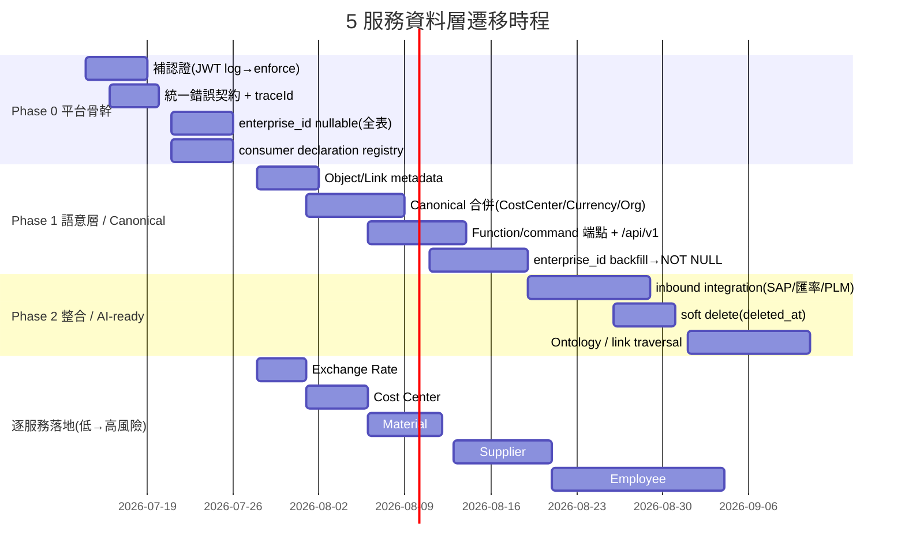

# 巨大機械 Middle Platform — 資料底層架構遷移計畫（底層服務域）

> **版本**：2026-07-09
> **範圍**：將現有 5 個 Node.js 中台服務（Cost Center / Exchange Rate / Material / Supplier / Employee）的資料層遷移至符合 Middle Platform 設計指南的架構
> **依據**：[giant-mdo-platform-design-guideline.txt](giant-mdo-platform-design-guideline.txt)
> **配套**：[giant-mdo-data-object-design.md](giant-mdo-data-object-design.md)
> **範本**：本文件結構完全依循 [migration-plan-sample](migration-plan-sample.txt)，不自創新結構

---

## 1. 現況分析

### 1.1 當前架構總覽

```text
┌─────────────────────────────────────────────────────────┐
│              現有 5 個獨立中台服務（微服務）                │
│                                                         │
│  ┌────────────┐ ┌────────────┐ ┌────────────┐          │
│  │ Cost Center│ │  Exchange  │ │  Material  │          │
│  │  (3022)    │ │Rate (3023) │ │  (3021)    │          │
│  └─────┬──────┘ └─────┬──────┘ └─────┬──────┘          │
│  ┌─────┴──────┐ ┌─────┴──────────────┴──────┐          │
│  │  Supplier  │ │        Employee            │          │
│  │  (3021)    │ │  (最大，20+ 實體，含加密)   │          │
│  └─────┬──────┘ └─────────────┬─────────────┘          │
│        │                       │                        │
│  ┌─────▼───────────────────────▼─────────────────────┐  │
│  │   Express + pg (PostgreSQL)，各服務獨立 DB / 表     │  │
│  │   - SQL 以 fs.readFileSync 每 request 讀檔（無快取）│  │
│  │   - 查詢 WHERE 1=1 + 字串拼接 IN/BETWEEN            │  │
│  │   - 多數服務純讀；寫入僅 Supplier / Employee        │  │
│  │   - 無 enterprise_id、無 pagination、無 soft delete │  │
│  └────────────────────────────────────────────────────┘ │
└─────────────────────────────────────────────────────────┘
```

### 1.2 現有資料實體盤點

| # | 類型 | 服務 | 實體 / 資料表 | 讀/寫 | 狀態 |
|---|------|------|--------------|:----:|------|
| 1 | 🟢 Master | Cost Center | `cost_center_master ⋈ cost_center_attribute` | 讀 | 3 個 GET，有效期 BETWEEN |
| 2 | 🟢 Config | Exchange Rate | `exchange_master` | 讀 | by_month_average |
| 3 | 🟢 Event | Exchange Rate | `exchange_history` | 讀 | by_date（UNION master） |
| 4 | 🟢 Master | Material | `material_master ⋈ basic_attribute ⋈ detail` | 讀 | attribute/common、by_date |
| 5 | 🟢 Context | Material | `material_plant_attribute` | 讀 | attribute/all、by_date/all |
| 6 | 🟡 Master | Supplier | `supplier_master ⋈ supplier_attribute` | 讀寫 | 6 碼 fan-out，search-then-upsert |
| 7 | 🟡 Relationship | Supplier | `supplier_data_source{plm_key,erp_key}` | 讀寫 | 新舊系統鍵綁定 |
| 8 | 🟡 Master | Employee | `employee_m` | 讀寫 | 批次，DELETE blocking_tables |
| 9 | 🟡 Child×8 | Employee | `employee_detail/attribute/privacy/bank/...` | 讀寫 | 批次，privacy 14 + bank 7 AES |
| 10 | 🟡 Child | Employee | `work_m / work_attribute / work_performance` | 讀寫 | 批次 |
| 11 | 🟡 Config | Employee | `salary_m / salary_detail / bonus_m / bonus_attribute` | 讀寫 | 批次，salary_detail + bonus_m amount AES |
| 12 | 🟡 Master | Employee | `organization_m` | 讀寫 | UUID、階層 pid、擋刪(500) |
| 13 | 🟡 Relationship | Employee | `employee_mapping_organization / compensation_mapping` | 讀寫 | 對照 |

> [!NOTE]
> `api_key`、`api_auth_routes`、`event_log`、`api_log` 為**框架 / 平台基礎設施資料**（認證、路由授權、稽核、請求日誌），非業務需求資料，**不納入**資料物件盤點與遷移對象。相關的認證強制（JWT）、統一錯誤契約等仍列為平台層的技術改善項目（§附錄 B），但不視為業務資料遷移。

### 1.3 關鍵架構問題

| 問題類型 | 說明 | 影響 |
|---------|------|------|
| 🔴 **Tenant 缺口** | 全模組**無 `enterprise_id`**，僅 `company_code` / `plant` 等業務碼 | 無法跨 enterprise 隔離，資料外洩風險 |
| 🔴 **JWT 未生效** | Cost Center / Exchange Rate 的 `jwtAuth` **import 但從未掛載**；啟動 log 與 swagger 卻宣稱有保護 | 安全漏洞；`api_auth_routes` RBAC 完全未執行 |
| 🔴 **機密硬編碼** | `JWT_SECRET`（Material/Supplier）與 DB 帳密（Supplier `utils/database.js` 明文）寫死在原始碼 | 機密外洩 |
| 🔴 **寫入未 Action 化** | Supplier / Employee 的 POST/PUT/DELETE 為裸端點，無 idempotencyKey、無標準錯誤碼 | 前台重試造成重複副作用 |
| 🔴 **拼字缺陷固化** | `vaild_from/vaild_to`、`bouns_types`、`local_name_coutry` 貫穿 DB/SQL/code | 跨模組 mapping 混亂 |
| 🟡 **無 canonical 合併** | `CostCenter`、`Currency`、`Organization` 分散，Item 未取代 Part/CostPart | 資料漂移、整合困難 |
| 🟡 **錯誤契約不一致** | 驗證用 `errors[]`、DB 用 `error`；Organization 刪除用 500、Employee 用 409 表達業務衝突 | 前台錯誤處理失效 |
| 🟡 **死碼** | Cost Center `update` SQL（param-shift + 逗號語法錯）、Supplier `SQL/update/*.sql`、Exchange 殘留 Supplier validation | 誤導維護 |
| 🟡 **無 pagination / soft delete** | 全模組列表無 `page/limit`；DELETE 為物理刪除 | 效能與可回復性 |
| 🟡 **非原子批次** | Supplier PUT、Employee 各批次 loop 每列各自交易，N+1 查詢，部分成功 | 資料一致性 |

---

## 2. 目標架構

### 2.1 Middle Platform 分層目標

```text
Front Office / Consumer App
  Costing / SuperBOM / Service / Dealer Scoring / HR portal / Workday 整合
        |
        | Read APIs / Action commands / domain events
        v
Middle Platform (目標)
  Object Types, Link Types, Functions, Actions, Integrations,
  Auth, Access Policies, Integration Events, Semantic Model
        |
        | Async sync / connector / adapter / mapping
        v
Back Office / External Systems
  SAP, ERP, PLM, 外部匯率, Workday
```

### 2.2 目標 API 形狀（指引 §9）

```text
GET    /api/v1/{pbc}                         # 列表：paginated / filterable / cacheable
GET    /api/v1/{pbc}/:id
GET    /api/v1/{pbc}/:id/links/:linkName     # 語意導航
POST   /api/v1/{pbc}/functions/:function     # 純查詢 / 計算（現行 GET 邏輯）
POST   /api/v1/{pbc}/commands/:action        # 寫入（Action）
```

現行路徑（如 `/api/cost_center/by_date`、`/api/material/attribute/common`、`/api/supplier`）→ **保留為 v1 相容別名**，同時提供 Function / command 形式，逐步遷移 consumer。

### 2.3 Database Group 對應

| Database Group | Object Types | 對應現行表 |
|---|---|---|
| `platform_core` | Organization | `organization_m` |
| `product_master` | Item, ItemPlantContext, Supplier, SupplierSourceKey | `material_*`, `supplier_*` |
| `finance_commercial` | CostCenter, Currency, ExchangeRate, ExchangeRateHistory | `cost_center_*`, `exchange_master`, `exchange_history` |
| `hr_workforce`（新增*） | Employee + 子表, Position, WorkPerformance, Salary*, Bonus*, mappings | `employee_*`, `work_*`, `salary_*`, `bonus_*`, `*_mapping*` |

> \* 偏離說明見資料設計文件 §5.4。框架資料 `api_key` / `api_auth_routes` / `event_log` / `api_log` 實體上位於 `platform_core`，但非業務資料，不列入遷移對象。

---

## 3. 遷移策略

### 3.1 遷移原則

遵循 MDO 設計指南核心原則：

1. **Additive first** — 先新增 nullable / default，不直接刪除或改名。
2. **Expand-contract** — 新舊並存過渡：add → dual-write → backfill → migrate consumer → deprecate → remove。
3. **不中斷 consumer** — 現行 GET 保留為 v1 相容別名。
4. **一次定義** — canonical 合併 CostCenter / Currency / Organization / Item。
5. **讀 = Function，寫 = Action** — 現行所有 GET → Resource query 或 Function；所有 POST/PUT/DELETE → Action。

### 3.2 遷移順序建議（風險由低到高）



**逐服務落地理由：**

1. **Exchange Rate**（最小、純讀、全域）→ 驗證骨架。
2. **Cost Center**（純讀、修拼字別名、補 enterprise）。
3. **Material**（純讀、SAP inbound 樣板、context object）。
4. **Supplier**（含寫入 + 新舊鍵綁定，先做 Action 化）。
5. **Employee**（最大、已有 event_log，最後做 Canonical 與 tenant 收斂）。

---

## 4. 遷移步驟詳細說明

### Phase 0：平台骨幹（不改對外行為）

#### P0-1：補齊認證

```text
任務：
  - Cost Center、Exchange Rate 掛上 jwtAuth（先 log-only 觀察，再 enforce）
  - 移除硬編碼 JWT_SECRET / DB 帳密 → 改讀 secret manager / 環境變數
  - Material / Supplier / Employee 已掛 jwtAuth，補齊 api_auth_routes RBAC 資料

驗收條件：
  - 所有 /api 端點需有效 JWT
  - 啟動 log 與 swagger 的 security 宣告與實作一致
```

#### P0-2：統一錯誤契約 + traceId（指引 §10.7）

```jsonc
{ "error": { "code": "SUPPLIER_KEY_CONFLICT", "message": "...", "details": {}, "traceId": "req_..." } }
```

| Status | 用法（修正點） |
|---|---|
| 409 | Supplier `erp_key` 衝突、重複 |
| 422 | Action precondition 不通過（**Organization「請由最底層刪除」由 500 → 422**；Employee `blocking_tables` 由 409 → 422） |
| 401/403 | 未登入 / scope 不足（**Cost Center、Exchange 補上實際 JWT enforcement**） |

向下相容：保留舊 `errors[]` / `error` 欄位一段過渡期。

#### P0-3：`enterprise_id` nullable（additive）

所有業務表新增 `enterprise_id` **nullable**（見 §5 落地步驟）。

#### P0-4：建立 Consumer Declaration Registry + Contract Gate

第一批涵蓋：`cost_center` 三讀、`exchange` 兩讀、`material` 四讀、`supplier` 讀+寫、Employee 主要讀寫。

#### P0-5：Employee 批次寫入正式命名為 Action

現有批次 POST/PUT/DELETE → 加 `idempotencyKey`（自然鍵）與標準錯誤碼；沿用既有稽核（audit log）機制記錄 actor/target/before/after。（稽核底層修繕屬平台框架維護，不在業務資料遷移範圍。）

---

### Phase 1：語意層與 Canonical

#### P1-1：建立 Object / Link metadata（ontology registry）

先描述、不改表——依資料設計文件 §3 / §4 建立 Object Type 與 Link Type 目錄。

#### P1-2：Canonical 合併

| Canonical | 合併對象 | 遷移方式 |
|-----------|---------|---------|
| `CostCenter` | `employee_attribute.cost_center_code`、`organization_m.cost_center_id` → 參照 | 雙寫 → 遷移 → 收斂 |
| `Currency` | 由 `exchange_master.from_/to_currency_code` 去重萃取 | 建主檔 → FK 參照 |
| `Organization` | 唯一 source of truth；跨 group 由 stable ID 參照 | — |
| `Item` | 取代散落的 Part / ServicePart / CostPart（未來） | expand-contract |

#### P1-3：新增 Function / command 端點並版本化

現行 GET 之外新增 Function/command 形式（見 §7.1），導入 `/api/v1`。

| Function（讀） | 取代的現行端點 |
|---|---|
| `resolveCostCenterAtDate` | `GET /api/cost_center/by_date` |
| `checkCostCenterExists` | `GET /api/cost_center/check_existence` |
| `getExchangeRate(from,to,at?)` | `GET /api/exchange/by_month_average` |
| `listExchangeRatesByDate` | `GET /api/exchange/by_date_and_month_average` |
| `getItemCommon` / `getItemWithPlant` | `GET /api/material/attribute/{common,all}` |
| `listItemsChangedBetween` | `GET /api/material/by_date/{common,all}` |
| `findSupplierByKey` / `checkSupplierExists` / `listSuppliersCreatedSince` | `GET /api/supplier/{attribute,check_existence,by_datetime}` |
| Employee/Salary/Work/Org 各 GET | 對應 resource query（CSV → `IN`） |

| Action（寫） | 取代的現行寫入 | precondition | idempotencyKey |
|---|---|---|---|
| `UpsertCostCenter` | （現無路由；廢棄壞掉的 update SQL） | 有效期不重疊 | `erpReferenceNumber` |
| `ImportExchangeRates` | （現無路由） | 幣別存在 | `from+to+type+period` |
| `UpsertItemFromSap` | （現無路由；灌檔） | `material_no` 合法 | `material_no+changed_at` |
| `RegisterSupplier` | `POST /api/supplier` | `plm_key\|bp` 至少一；`erp_key` 一致 | `plm_key\|bp` |
| `UpdateSupplierAttributes` | `PUT /api/supplier/attribute` | 至少一搜尋鍵；命中 | 建議新增 `requestId` |
| `CreateEmployees` / `DeleteEmployee` | `POST/DELETE employee_m` | 去重 / 無子表參照 | `employee_id` |
| `Create/Update/Delete{Detail,Attribute,Privacy,Bank,...}` | 對應批次端點 | FK 存在 / 日期範圍 | natural key |
| `Create/Update/DeleteOrganization` | `organization_m` | 階層完整性 | — |
| `Create/Update Salary/Bonus/Work*` | 對應批次端點 | polymorphic FK / 型別條件 | natural key |

#### P1-4：`enterprise_id` backfill → filter → NOT NULL

分域逐張表（見 §5）。

---

### Phase 2：整合與 AI-ready

#### P2-1：導入 inbound integration

Material / Cost Center / Exchange / Supplier 導入 inbound（staging + Action 寫入 + `erpStatus`）——見 §8。

#### P2-2：soft delete

導入 `deleted_at`，物理刪除下線；Employee `blocking_tables` 與 Organization 階層擋刪改為 soft delete + 標準 422。

#### P2-3：Ontology export、link traversal、Object Explorer（指引 §12、§16）。

---

## 5. Tenant / Organization 設計（指引 §6）——P0 最大缺口

```text
ENTERPRISE (enterpriseId = hard tenant boundary，由 auth context 解出，不信任 request body)
  ├── SALES_COMPANY / GSC
  ├── MANUFACTURING_COMPANY / GMC
  ├── DEPARTMENT / HQ
  └── channel: distributor → dealer → store
```

**落地步驟（每張 tenant-scoped 表 staged rollout）：**

1. 所有業務表新增 `enterprise_id` **nullable**（additive 安全）。
2. Backfill：以現行 `company_code` / 服務歸屬推導 enterprise（需一次性 mapping 表）。
3. 查詢層加入 `enterprise_id` filter（由 JWT/session 帶入），先寬鬆（null 視為集團共用）。
4. 全 consumer 遷移後將 `enterprise_id` 收斂為 **NOT NULL**。
5. `company_code` / `gsc` / `cost_center_code` / `plant` 降級為**業務 scope**，不再當 tenant key。

**特例：**
- `ExchangeRate` 現為全域 → 設計為「集團預設值 + enterprise 可覆寫」的 context 模型，避免各 enterprise fork。
- `Item` / `Supplier` 為 SAP 主檔，多屬集團層共享，`enterprise_id` 主要用於存取控制與未來多法人。

Background jobs / inbound sync 必須顯式宣告執行 context（enterprise X 或 system/superuser），cross-tenant 只允許受控 `platform:cross-tenant` scope 且 audit。

---

## 6. Database Grouping（指引 §8）

| Group | 納入 Object | 對應現行表 |
|---|---|---|
| `platform_core` | Organization, semantic model, access policy | `organization_m` |
| `product_master` | Item, ItemPlantContext, Supplier, SupplierSourceKey | `material_*`, `supplier_*` |
| `finance_commercial` | CostCenter, Currency, ExchangeRate, ExchangeRateHistory | `cost_center_*`, `exchange_master`, `exchange_history` |
| `hr_workforce`（新增*） | Employee + 子表, Position, WorkPerformance, Salary*, Bonus*, mappings | `employee_*`, `work_*`, `salary_*`, `bonus_*`, `*_mapping*` |

**跨 group 規範（沿用指引）：** 跨 group 不用 DB FK，改 stable ID + API/projection/event；cross-domain write 走 Action/event；schema evolution additive-first。

典型跨 group 關係：`Organization.cost_center_id`（platform_core → finance_commercial）、`EmployeeAttribute.cost_center_code`（hr_workforce → finance_commercial）、`Item ↔ Supplier`（product_master 內）→ 皆改為 stable-ID 參照 + resolver Function。

---

## 7. API 重新設計（指引 §9、§10）

### 7.1 標準形狀

（見 §2.2）現行路徑保留為 v1 相容別名，同時提供 Function / command 形式。

### 7.2 版本與 breaking change（expand-contract，指引 §10.5）

- 導入 `/api/v1`；現行無版本前綴的路由視為 v1，透過 gateway rewrite 相容。
- 加 `enterprise_id`、加別名欄位（`validFrom` / `bonusType` / `localNameCountry`）、加 Action 端點 = **安全變更**。
- 未來移除 `vaild_from` / `bouns_types` 拼字欄位、改型別 = **breaking** → 走 add → dual → migrate → deprecate → remove。

### 7.3 統一錯誤契約（見 §P0-2）

### 7.4 Consumer Declaration（指引 §10.3）

為每個現行 consumer（推測：Costing、SuperBOM、Service、Dealer Scoring、HR portal、Workday 整合）建立 manifest，宣告依賴的 endpoint + 欄位。這是後續 contract gate（§10）能自動保護的前提。

---

## 8. 整合設計（指引 §7）

| 服務 | 方向 | 來源系統 | 模式 |
|---|---|---|---|
| Material | inbound | SAP 物料主檔 | `RECEIVED→STAGED→MAPPED→APPLIED`，Action `UpsertItemFromSap` 寫入，`erpStatus/erpReferenceNumber/erpSyncAt` |
| Cost Center | inbound | ERP 成本中心 | 同上，Action `UpsertCostCenter` |
| Exchange Rate | inbound | 外部匯率 | Connector envelope + `ImportExchangeRates` |
| Supplier | inbound/outbound | PLM(舊) ↔ SAP/ERP(新) | `RegisterSupplier` 綁定並發 integration event；idempotency `enterpriseId+source+messageId` |
| Employee | inbound（未來） | Workday | `employee_id_mapping` 已是 source key 雛形 |

現況這些「外部來源」是離線灌檔（純讀服務）；遷移後改為：Connector 產生 envelope → Gateway 驗 tenant/schema → staging → **透過 Action 寫入**（不可直接 table write）→ 失敗進 exception queue。所有 ERP-synced 表加 `erpStatus / erpReferenceNumber / erpSyncAt / erpLastError`（指引 §4.1）。

**ERP 同步欄位（見資料設計文件 §6）：**

```typescript
interface ErpSyncFields {
  erpStatus: 'PENDING' | 'SYNCING' | 'SYNCED' | 'ERROR' | 'FAILED';
  erpReferenceNumber: string;
  erpSyncAt: string;      // ISO 8601
  erpLastError?: string;
}
```

```text
PENDING → SYNCING → SYNCED
                  → ERROR → RETRY → SYNCED
                                  → FAILED (進 exception queue)
```

---

## 9. 風險與緩解

| 風險 | 影響 | 緩解措施 |
|------|------|---------|
| 補 JWT enforcement 造成既有 consumer 401 | 服務中斷 | 先 log-only 觀察一段期間，補齊 `api_auth_routes` 後再 enforce |
| 大範圍 rename（拼字修正）造成中斷 | consumer 讀不到欄位 | expand-contract，DB 欄位保留、API 別名對外 |
| `enterprise_id` backfill 推導錯誤 | 資料跨租戶錯置 | 一次性 mapping 表 + 人工核對；先寬鬆 null 視為集團共用 |
| inbound Action 化改寫既有灌檔流程 | 資料同步中斷 | staging 雙軌並行，驗證後切換 |
| AES 金鑰硬編碼（預設 GUID） | PII 以公開金鑰加密 | 移至 secret manager，重新加密既有資料 |
| 批次寫入非原子（部分成功） | 資料不一致 | 遷移為單一交易 + per-row 補償 + event_log 快照 |
| 後端 schema 與 consumer 型別不一致 | 運行期錯誤 | consumer declaration，API specification 驅動型別 |

---

## 10. Release Guardrails（指引 §13）

每次 schema/API/auth 改動必跑：

1. **Contract gate**：比對 consumer contract registry 與 API specification。
2. **API documentation freshness**：public endpoint / schema 變更必須重新發布 API specification。
3. **Schema compatibility gate**：擋 required / unique / drop / narrowing change。
4. **Build / typecheck / tests**。
5. **Post-deploy verification**：含各 consumer declaration 宣告的路由。

schema 預設 additive-first；rename 走 expand-contract；drop/required/unique 為最後階段。

---

## 11. 逐模組 Design Review Checklist（指引 §14 摘要）

| 檢查點 | Cost Center | Exchange | Material | Supplier | Employee |
|---|:---:|:---:|:---:|:---:|:---:|
| enterpriseId 導入 | ⬜ | ⬜(context) | ⬜ | ⬜ | ⬜ |
| JWT 實際 enforce | 🔴需補 | 🔴需補 | ✅ | ✅ | ✅ |
| 機密移出原始碼 | ⬜ | ⬜ | 🔴 JWT_SECRET | 🔴 DB 帳密+JWT | ⬜ ENCRYPTION_GUID |
| 寫入走 Action | n/a(讀) | n/a | n/a | 🟠 upsert→Action | 🟠 批次→Action |
| Canonical 合併 | 🟠 CostCenter | 🟠 Currency | ✅ Item | 🟠 Supplier | 🟠 Organization |
| Link reverseName | ⬜ | ⬜ | ⬜ | ⬜ | ⬜ |
| 整合事件(ERP) | ⬜ inbound | ⬜ inbound | ⬜ SAP | ⬜ PLM↔ERP | ⬜ Workday |
| 統一錯誤契約 | ⬜ | ⬜ | ⬜ | 🟠 409/422 | 🟠 500→422 / 409→422 |
| soft delete | n/a | n/a | n/a | n/a | 🔴 物理刪除 |
| pagination | 🔴需補 | 🔴需補 | 🔴需補 | 🔴需補 | 🔴需補 |
| consumer declaration | ⬜ | ⬜ | ⬜ | ⬜ | ⬜ |

---

## 附錄 A — 完整 API input/output 欄位清單

> 查詢回傳一律包在 `{ success, message, rowCount, data[] }`；下表 Output 指 `data[]` 內容。批次寫入回傳 `{ success, message, summary{...}, results[], errors?, warnings? }`。多值查詢參數支援逗號分隔 `IN`。所有 SQL 以 `fs.readFileSync` 每 request 讀檔，`WHERE 1=1` + 字串拼接。

### A.1 Cost Center（base `/api`，⚠ JWT 宣告但未掛載，PORT 3022）

| 端點 | Input | Output(data[]) | 表 / 條件 |
|---|---|---|---|
| GET /api/cost_center/attribute | `cost_center_id`(str, req, 單值) | cost_id(int), cost_center_id, profit_center, functional_area, cost_center_name, vaild_from(YYYY-MM-DD), vaild_to, cost_center_category, company_code | `cost_center_master M ⋈ cost_center_attribute A ON M.cost_id=A.cost_id`，`WHERE cost_center_id=$1` |
| GET /api/cost_center/by_date | `at`(ISO date, req) | 同上 9 欄 | 同 JOIN，`WHERE $1 BETWEEN A.vaild_from AND A.vaild_to ORDER BY M.cost_center_id` |
| GET /api/cost_center/check_existence | `cost_center_id`(str, req) | cost_id, cost_center_id（不存在回 rowCount:0） | `cost_center_master` 單表 |
| POST /auth/token · refresh · verify | `accessKey` / Bearer | `{token, type:Bearer, expiresIn}` / `{sourceName, issuedAt, expiresAt}` | `api_key` |
| GET /cost-center/health | — | `{status, service, port, environment, timestamp}` | — |

> 死碼：`SQL/cost_center/update/update_cost_center_attribute.sql`（`$3` 重複 param-shift + `WHERE` 前多逗號，未掛路由）→ 廢棄改 `UpsertCostCenter`。

### A.2 Exchange Rate（base `/api`，⚠ JWT 宣告但未掛載，PORT 3023）

| 端點 | Input | Output(data[]) | 表 / 條件 |
|---|---|---|---|
| GET /api/exchange/by_month_average | `from_currency_code`, `to_currency_code`(str, req) | from_currency_code, to_currency_code, from_exchange_amount(num), to_exchange_amount(num), created_at(YYYY-MM-DD) | `exchange_master`，`exchange_type='MONTH_AVERAGE_RATE'` |
| GET /api/exchange/by_date_and_month_average | `start_at`, `end_at`(ISO date, req) | 同上 5 欄 | `exchange_history ∪ exchange_master`，`type=MONTH_AVERAGE_RATE AND created_at BETWEEN $1 AND $2`，`ORDER BY from,to,created_at DESC` |
| /auth/* · /exchange/health | 同 Cost Center | 同 | `api_key` |

> 死碼：`validation/exchange/createCurrencyValidation.js` / `updateCurrencyValidation.js` 實為 Supplier 欄位殘留 → 刪除。

### A.3 Material（base `/api`，✅ JWT enforced，PORT 3021）

| 端點 | Input | Output(data[]) | 表 / JOIN |
|---|---|---|---|
| GET /api/material/attribute/common | `material_no`(req, 單值) | material_id, material_no, material_type, material_item, material_group_no, material_group_description, material_inventory_unit, material_base_unit, material_hierarchy, model_name, is_giip(bool), authorization_group, old_material_no, cross_plant_material_status, net_weight(num), gross_weight(num), volume(num), weight_unit, volume_unit | `material_master M ⋈ material_basic_attribute A`，`WHERE M.material_no=$1` |
| GET /api/material/attribute/all | `material_no`, `plant`(req) | common 19 欄 + plant, plant_no, plant_material_status, is_purchase(bool), commodity_code, country_of_origin, purchase_group, stock_group, mrp_controller, procurement_type, special_procurement_type | + `material_plant_attribute C`，`WHERE M.material_no=$1 AND C.plant=$2`（INNER JOIN 會濾掉無廠別料件） |
| GET /api/material/by_date/common | `start_at`, `end_at`(ISO, req) | common 19 欄 + material_description | `M ⋈ A ⋈ material_detail B`，`(M.created_at OR A.changed_at OR B.changed_at) BETWEEN`（⚠ 缺 `M.changed_at`）`ORDER BY M.material_no` |
| GET /api/material/by_date/all | `start_at`, `end_at`(ISO, req) | common + material_description + 廠別 11 欄 | `M ⋈ A ⋈ B ⋈ C`，4 表 OR BETWEEN，**無 plant 過濾**（依 plant 展開多列） |
| /auth/* · /health | — | — | `api_key` |

### A.4 Supplier（base `/api`，✅ JWT enforced，PORT 3021，⚠ DB 帳密硬編碼）

| 端點 | Input | Output | 表 / 邏輯 |
|---|---|---|---|
| GET /api/supplier/attribute | `search_key`(req) | `supplier_attribute.*`（supplier_id, gcm_code, gck_code, gev_code, gct_code, business_partner_no, gtm_code, brief_chinese, brief_english, fullname_chinese, fullname_english, phone, address） | `supplier_attribute`，6 碼 OR fan-out（gcm/gck/gev/gct/business_partner_no/gtm，`IS NOT NULL AND !='' AND =$1`） |
| GET /api/supplier/by_datetime | `created_at`(ISO datetime, req) | 同 SupplierAttribute | `supplier_master sm LEFT JOIN supplier_attribute sa`，`sm.created_at>=$1 ORDER BY sm.created_at DESC` |
| GET /api/supplier/check_existence | `search_key`(req) | supplier_id | 6 碼 fan-out，只 SELECT supplier_id |
| POST /api/supplier | body(≥1 of `plm_key\|business_partner_no`；另 gcm/gck/gev/gct/gtm_code, brief_*, fullname_*, phone, address 皆選填) | Nested `{supplier_attribute{...13}, supplier_data_source{plm_key, erp_key}}` | search-then-upsert：0命中→**201**建立 / 1命中且 erp_key 一致→**200**綁定 / erp 衝突→**409** / ≥2→**409**；`erp_key=business_partner_no` |
| PUT /api/supplier/attribute | body(≥1 field；可搜尋鍵 plm_key/gcm/gck/gev/gct/gtm_code/business_partner_no；另可更新 erp_key, brief_*, fullname_*, phone, address) | Nested[]（批次） | inline SQL 動態 UNION 搜尋；命中列各自更新；空值清空（`""`/`null`→清空）；`business_partner_no`→同步 `erp_key`；每列 event_log；0命中→**404** |
| /auth/* · /health | — | — | `api_key` |

> 死碼：`SQL/supplier/update/*.sql`、`SQL/supplier/attribute/update_supplier_attribute.sql`（route 用 inline SQL，空值語意相反）→ 刪除。批次 PUT 每列各自交易（非原子）。

### A.5 Employee 域（base `/api`，✅ JWT + RBAC enforced，PORT 見 env）

> 批次寫入回傳 `{summary{total, success, failed, empty, duplicate?, invalid_*?}, results[], errors?, warnings?}`；狀態碼 POST 201/207/400、PUT 200/207/400。所有查詢 `WHERE 1=1` + CSV `IN`，**無 JOIN**（跨表驗證用序列 handleGet 查詢）。每列寫入透過平台稽核機制記錄 CREATE/UPDATE/DELETE（DELETE 存整列快照）。

**Employee 主體與子物件**

| 端點（GET/POST/PUT/DELETE） | Input | Output / 表 | 特殊 |
|---|---|---|---|
| /api/employee/employee_m | GET `employee_id`,`id`(CSV) / POST body `employee_id`(**scalar 陣列**) / DELETE `id` | `employee_m{id, employee_id, create_date}` | **DELETE blocking_tables**：pid 表(emergency_contact, employee_attendance, employee_attribute, employee_bank, employee_detail, employee_id_mapping, employee_privacy, bonus_m) + employee_id 表(work_m) 有資料→**409**；自然鍵 employee_id 去重；無 PUT |
| /api/employee/employee_detail | GET `pid`(CSV) / `employees[]{pid, gender, nationality}` / `{id,...}` / `id` | `employee_detail{id, pid, gender, nationality}` | POST dup(pid) + FK(employee_m)；⚠ 檔頭誤植 `require('inspector').console` |
| /api/employee/emergency_contact | `pid` / `contacts[]{pid, contact_name, relationship, primary_phone, primary_address}` | `emergency_contact` 同欄 | POST 僅 FK 檢查，無 dup |
| /api/employee/employee_attendance | GET `id`,`pid`,`types`(CSV),`start_date`,`end_date` / `attendances[]{pid, types, start_date, end_date, reason, hour_amount}` | `employee_attendance` 同欄 | ⚠ POST 無日期驗證（僅 GET 有）；GET end-only 過濾誤用 start_date |
| /api/employee/employee_attribute | `pid`(CSV) / `employees[]{pid, +27 欄}` | `employee_attribute`（employee_type, job_category, init_password, work_mail, work_phone_extension, en_first/middle/last_name, **local_name_coutry**(sic), local_first/last_name, ad_email, mail_domain, pay_group, hire_date, termination_date, union_membership(+start/end_date), home_phone, terminated, ad_account, company_code, cost_center_code, company_name, start_date, end_date） | POST dup(pid)+FK；日期範圍驗證 |
| /api/employee/employee_bank | `pid`(CSV) / `banks[]{pid, country, account_number, bank_name, bic, account_name, branch_name, branch_code}` | `employee_bank` 同欄（**7 欄 AES 加密**，讀時解密） | encryptFields 於寫入；解密失敗靜默回密文 |
| /api/employee/employee_id_mapping | GET `pid`(CSV),`source_application`,`employee_code` / `employees[]{pid, source_application, employee_code}` | `employee_id_mapping{id, pid, source_application, employee_code, create_date}` | 唯一 `pid+source_application`；⚠ inspector.console |
| /api/employee/employee_privacy | `pid`(CSV) / `employees[]{pid, +22 欄}` | `employee_privacy`（**14 欄 AES**：birthday, birth_country, birth_city, marital_status, national_id_value, national_country, passport_country/type/id, visa_country/id_type/id, arc_value/country；**8 日期明文**：national/passport/visa/arc 各 start/end_date） | 日期 `YYYY-MM-DD` + end≥start 配對驗證；dup(pid)+FK |

**Work / Salary / Bonus**

| 端點 | Input | Output / 表 | 特殊 |
|---|---|---|---|
| /api/work/work_m | GET `id`,`employee_id`(CSV) / `works[]{employee_id, types}` | `work_m{id, employee_id→employee_m, types}` | FK(employee_m) |
| /api/work/work_attribute | `pid`(CSV) / `work_attributes[]{pid, position_title, business_title, manager_employee_id, start_date, end_date, job_skills_code, job_skills_title}` | `work_attribute` 同欄 | dup(pid) + FK(work_m) + manager FK(employee_m) |
| /api/work/work_performance | `pid`(CSV) / `performances[]{pid, review_year(1900..cur+1), review_result, start_date, end_date}` | `work_performance` 同欄 | dup 檢查已註解（一年多筆）；⚠ `uplicateCount` 拼字全域洩漏 |
| /api/salary/salary_m | GET `id`,`work_id`(CSV) / POST body `work_id`(**scalar 陣列**) / PUT `salaries[]{id, work_id}` | `salary_m{id, work_id→work_m}` | FK(work_m)；summary 含 `invalid_work_id` |
| /api/salary/salary_detail | `pid`,`profile_id`(CSV) / `salary_details[]{pid, grade_id, profile_id, pay_range_maximum, pay_range_minimum, base_salary_plan, base_salary_start_date, base_salary_amount, base_salary_frequency, base_salary_currency, period_salary_plan}` | `salary_detail`（**base_salary_amount AES**） | ⚠ POST 以 `pid` 誤驗 salary_m（應 profile_id）；dup 檢查已註解 |
| /api/salary/bonus_m | GET `id` 或 (`pid`+`parent_types`)(CSV) / `bonuses[]{pid, parent_types(01員工/02職務), bouns_types(01/02), bonus_title, amount, currency, effective_date, end_date, pay_date}` | `bonus_m`（**amount AES**） | **polymorphic FK**：parent_types 01→employee_m / 02→work_m；bouns_types=02→pay_date 必填；PUT 不改 pid/parent_types，不重驗 polymorphic |
| /api/salary/bonus_attribute_discard_and_save_temporarily | `pid`(CSV),`effective_date`(≥),`end_date`(≤) / `bonusAttributes[]{pid, bonus_title, amount, currency, effective_date, end_date, pay_date}` | `bonus_attribute`（amount **明文**，異於 bonus_m） | ⚠ 檔名誤導；型別驗證讀 `bonus_m.types`（實為 parent_types/bouns_types）→永遠 undefined 失效 |

**Organization / Mapping**

| 端點 | Input | Output / 表 | 特殊 |
|---|---|---|---|
| /api/organization/organization_m | GET `id`,`company_code`,`company_name`,`name`,`cost_center_id`,`workday_id`(CSV) + `pid`(支援 null/IS NULL) / body key `organization_m[]{company_code, company_name, name, sub_type_id, sub_type, hr_partner, inactive, cost_center_id, manager_id, pid, workday_id, start_date, end_date}` / PUT 加 `id` | `organization_m`（UUID id, 階層 pid→自身, manager_id→employee_m, cost_center_id→CostCenter） | **DELETE 階層擋刪**：有子節點(pid=id)→**HTTP 500**「請由最底層組織開始刪除」（改 422）；pid/manager_id 存在性驗證；inline `@tablename` 模板 |
| /api/mapping/compensation_mapping | GET `workday_code`,`application_name`,`code`(CSV) / `mappings[]{workday_code, application_name, code}` / PUT 加 `id` / DELETE `id` | `compensation_mapping{id, workday_code, application_name, code}` | 唯一三元組；PUT summary 含 `not_found`；DELETE 404 檢查 |
| /api/mapping/employee_mapping_organization | GET `id`,`employee_id`,`organization_id`,`work_id`(CSV) / POST **單筆** `{employee_id, organization_id, work_id, start_date}` / DELETE `id` | `employee_mapping_organization{id, employee_id, organization_id, work_id, start_date, create_date}` | FK(employee_m/organization_m/work_m)；唯一 `employee_id+organization_id`；**無 PUT**；SQL 在 `SQL/employee/` 資料夾（folder 錯位） |

### A.6 平台框架端點（非業務需求資料，僅列作邊界說明）

> `api_key`、`api_auth_routes`、`event_log`、`api_log` 為框架 / 基礎設施資料，**不納入業務資料遷移**。以下僅列出與各業務服務共存的認證與健康檢查端點，作為整合邊界說明；其 CRUD 與資料表不在本計畫遷移範圍。

| 端點 | Input | Output |
|---|---|---|
| POST /auth/token | `accessKey` | `{token, type:Bearer, expiresIn}` |
| POST /auth/refresh | Bearer header(舊 token) | `{token, type, expiresIn}` |
| GET /auth/verify | Bearer header | `{sourceName, issuedAt, expiresAt}` |
| GET /{module}/health | — | `{status, service, port, environment, timestamp}` |

**認證與授權機制（平台框架，非業務資料）：** 各服務以 JWT（`Authorization: Bearer`）認證，並以路由層 RBAC 授權；Material / Supplier / Employee 已啟用，**Cost Center / Exchange Rate 宣告但未掛載**（安全缺口，見 §附錄 B）。此機制依賴框架表，屬平台層統一治理範疇，不在業務資料遷移之列。

---

## 附錄 B — 現況技術債（遷移時一併處理）

**嚴重（安全）**

1. **JWT 中介層未掛載**：Cost Center / Exchange Rate 的 `jwtAuth` import 後從未 `app.use`，所有 `/api` 端點無認證，但啟動 log 與 swagger `security` 宣稱有保護 → 優先修，`api_auth_routes` RBAC 亦未執行。
2. **機密硬編碼**：Material / Supplier `JWT_SECRET`（`utils/jwtAuth.js`）；Supplier DB host/db/user/**password 明文**（`utils/database.js`）；Employee AES 預設 `ENCRYPTION_GUID`（公開常數，env 未設時以公開金鑰加密 PII）。
3. **AES 為 CBC 無認證**（無 HMAC/GCM）；GET 解密失敗**靜默回傳密文**（employee_bank / employee_privacy）。

**中度（正確性）**

4. `cost_center_attribute.vaild_from/vaild_to` 拼字錯誤貫穿 DB/SQL/swagger（保留欄位、API 別名 `validFrom/validTo`）。
5. Cost Center `SQL/.../update_cost_center_attribute.sql`：`$3` 重複（functional_area 與 cost_center_name 皆用 $3，param-shift）+ `WHERE` 前多逗號語法錯 + 未掛路由 → 廢棄改 `UpsertCostCenter` Action。
6. Material `by_date` OR 條件缺 `M.changed_at`（master 被更新時漏抓增量）；`attribute/all` INNER JOIN 濾掉無廠別料件；`by_date/all` 無 plant 過濾（多列展開）。
7. Supplier `SQL/update/*.sql` 與 inline SQL 空值語意相反（檔案 COALESCE 保留、inline 清空）→ 刪死碼。
8. Bonus `bouns_types` 拼字貫穿 DB/SQL/code/contract；`bonus_attribute` 型別驗證讀不存在的 `bonus_m.types` → 驗證永遠失效。
9. `salary_detail` POST 以 `detail.pid` 誤驗 `salary_m`（應 `profile_id`）。
10. `work_performance` / `organization_m` 的 `uplicateCount` 拼字（隱式全域）→ `duplicateCount` 恒 0；`dataCount` 未宣告全域洩漏。
11. `employee_detail` / `employee_id_mapping` 檔頭 `const { console } = require('inspector')` 覆寫全域 console。

**輕度（一致性 / 效能）**

12. 全模組無 pagination → 列表端點補 `page/limit` 或 `cursor`。
13. 全模組無 soft delete → 導入 `deleted_at`；Employee/Organization 物理刪除改 soft delete。
14. Organization DELETE 用 HTTP 500 表達業務衝突 → 改 422；Employee blocking_tables 409 → 422。
15. 錯誤 envelope 不一致（驗證 `errors[]` vs DB `error`）→ 統一 `error{code,message,details,traceId}`。
16. SQL 以 `fs.readFileSync` 每 request 讀檔（無快取，阻塞 event loop）→ 啟動時載入一次。
17. 批次寫入非原子（每列各自交易，N+1 查詢）→ 單一交易 + per-row 補償。
18. CORS `app.use(cors(...))` 全模組被註解（設定虛設）；rate-limit 註解「60 requests」但 `max:3000`。
19. `employee_mapping_organization` route 在 `routes/mapping/` 但 SQL 在 `SQL/employee/`（folder 錯位）；`bonus_attribute_discard_and_save_temporarily.js` 檔名誤導（實為一般 CRUD）。
20. `apiFunction.js` 的 `handlePost/handlePut/handleDelete/handleRequest`、`common.js` 的 `formatBatchResponse` 在多數服務為未使用死碼；`routes/index.js` 殘留 Supplier 專案的 `create.js/update.js` 特例分支。
21. swagger server URL 與實際 PORT 不符（Cost Center 標 3021 實 3022；Exchange 標 3021 實 3023）；health 路徑連字號 vs API 底線不一致。

---

## 附錄 C — 相關文件

- [MDO 設計指南](giant-mdo-platform-design-guideline.txt)
- [資料物件設計文件（底層服務域）](giant-mdo-data-object-design.md)
- 資料物件設計範本：[data-object-design-sample](data-object-design-sample.txt)
- 遷移計畫範本：[migration-plan-sample](migration-plan-sample.txt)
