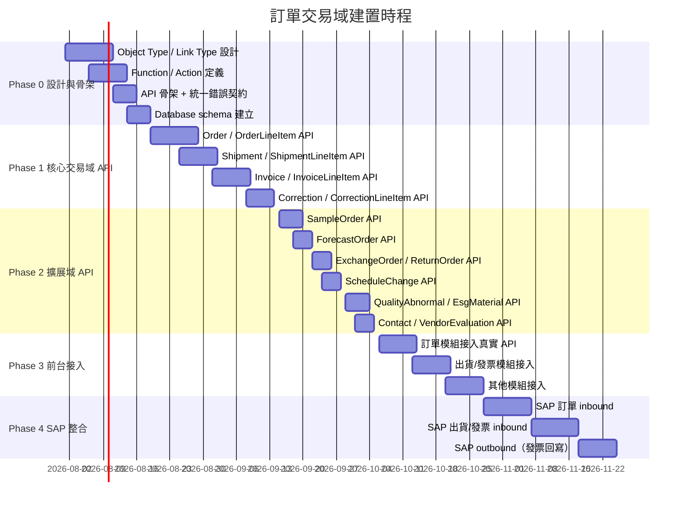

# 巨大機械 Middle Platform — 資料底層架構遷移計畫（訂單交易域）

> **版本**：2026-07-09
> **範圍**：為前台供應商平台的 18 個業務 Object Types（訂單 / 出貨 / 發票 / 折讓 / 索樣 / 預測 / 排程 / 品質 / ESG / 聯絡人 / 評鑑）建立符合 Middle Platform 設計指南的資料物件設計與 API 架構
> **依據**：[giant-mdo-platform-design-guideline.md](giant-mdo-platform-design-guideline.md)
> **配套**：[giant-mdo-data-object-design1.md](giant-mdo-data-object-design1.md)、[gap-analysis-report-v1.md](gap-analysis-report-v1.md)
> **前置**：[giant-mdo-migration-plan.md](giant-mdo-migration-plan.md)（底層服務域遷移計畫）

---

## 1. 現況分析

### 1.1 當前架構總覽

```text
┌─────────────────────────────────────────────────────────────────┐
│              前台供應商平台（React + TypeScript）                  │
│                                                                 │
│  ┌─────────────┐ ┌─────────────┐ ┌─────────────┐              │
│  │ 訂單管理     │ │ 出貨管理     │ │ 發票管理     │              │
│  │(OrderRow等)  │ │(ShipmentData)│ │(InvoiceRecord)│             │
│  └──────┬──────┘ └──────┬──────┘ └──────┬──────┘              │
│  ┌──────┴──────┐ ┌──────┴──────┐ ┌──────┴──────┐              │
│  │ 折讓/索樣   │ │ 排程/預測    │ │ 品質/ESG    │              │
│  │(Correction) │ │(Forecast等)  │ │(Quality等)   │              │
│  └──────┬──────┘ └──────┬──────┘ └──────┬──────┘              │
│         │                │                │                     │
│  ┌──────▼────────────────▼────────────────▼───────────────────┐│
│  │   各組件內嵌 TypeScript 介面 + 本地 Mock Data               ││
│  │   - 無真實 API 呼叫（無 GET/POST）                          ││
│  │   - 無 enterpriseId 租戶隔離                                ││
│  │   - 無 ERP 同步欄位                                        ││
│  │   - 命名不一致（Vendor/Supplier, material/partNo 等）       ││
│  │   - 計算邏輯散落在前端組件中                                 ││
│  │   - 無 Action / Function 概念                              ││
│  └────────────────────────────────────────────────────────────┘│
│                          ↕ （目前無連線）                        │
│  ┌────────────────────────────────────────────────────────────┐│
│  │   SAP / ERP（訂單、出貨、發票、物料主檔）— 尚未整合         ││
│  └────────────────────────────────────────────────────────────┘│
└─────────────────────────────────────────────────────────────────┘
```

### 1.2 現有資料實體盤點

| # | 類型 | 模組 | 前台介面 / 資料檔 | 讀/寫 | 狀態 |
|---|------|------|------------------|:----:|------|
| 1 | 🔴 Transaction | 訂單 | `OrderRow`（AdvancedOrderTable.tsx）| mock | 40+ 欄位，Aggregate Root |
| 2 | 🔴 Child | 訂單行項目 | `ScheduleLine`（AdvancedOrderTable.tsx）| mock | 5 欄位 |
| 3 | 🔴 Transaction | 出貨 | `ShipmentData`（shipmentData.ts）| mock | 含出貨行項目 |
| 4 | 🔴 Transaction | 發票 | `InvoiceRecord`（invoiceStore.ts）| mock | 含發票行項目 |
| 5 | 🔴 Transaction | 折讓 | `CorrectionOrder`（correctionData.ts）| mock | 25 欄位 |
| 6 | 🔴 Transaction | 索樣 | `SampleOrderRecord`（sampleOrderData.ts）| mock | 22 欄位 |
| 7 | 🔴 Transaction | 預測 | `ForecastOrder`（forecastData.ts）| mock | 17 欄位 |
| 8 | 🔴 Transaction | 換貨 | `OrderRow`（exchangeOrderData.ts）| mock | 複用訂單介面 |
| 9 | 🔴 Transaction | 退貨 | `OrderRow`（returnOrderData.ts）| mock | 複用訂單介面 |
| 10 | 🔴 Transaction | 排程 | `ScheduleRow`（scheduleData.ts）| mock | 17 欄位 |
| 11 | 🔴 Transaction | 品質 | `QualityAbnormalPage`（組件）| mock | 欄位未正式定義 |
| 12 | 🔴 Master | 聯絡人 | `ContactDetailOverlay`（組件）| mock | 供應商子物件 |
| 13 | 🔴 Config | 評鑑 | `VendorEvaluationPage`（組件）| mock | 供應商評鑑 |
| 14 | 🔴 Master | ESG 材料 | `EsgMaterialRecord`（esgMaterialData.ts）| mock | 110 筆 mock |
| 15 | 🔴 Relationship | 物料成分 | `MaterialComposition`（partsMaintenanceData.ts）| mock | ESG 關聯 |

> [!NOTE]
> 本盤點範圍為前台系統的業務資料模型。與底層服務域遷移計畫不同，此處的「現有」是前台 TypeScript 介面與 mock data，而非後端資料庫表。遷移方向為：**前台 mock → 設計 MDO Object Types → 建立後端 API → 前台接入真實 API → SAP 整合**。

### 1.3 關鍵架構問題

| 問題類型 | 說明 | 影響 |
|---------|------|------|
| 🔴 **MDO 未設計** | 訂單交易域 14 個核心 Object Types 在 MDO 設計文件中**完全未定義** | 無法建立標準 API |
| 🔴 **Tenant 缺口** | 所有前台 TypeScript 介面**無 `enterpriseId`** | 無法租戶隔離 |
| 🔴 **ERP 同步缺口** | 無 `erpStatus` / `erpReferenceNumber` / `erpSyncAt` | 無法與 SAP 同步 |
| 🔴 **Canonical 衝突** | `Vendor` vs `Supplier`、`PartRecord` vs `Item`、料號 5 種命名 | 跨模組整合困難 |
| 🟡 **無 Action 化** | 前台所有寫入為本地 state mutation，無 idempotencyKey / precondition | 重試造成副作用 |
| 🟡 **計算邏輯散落** | 稅額、金額、匯率換算在各組件 render 中 | 業務規則不可重用 |
| 🟡 **無 Link Type** | 跨 Object 關聯僅以 FK 欄位引用，無語意 Link | 無法 link traversal |
| 🟡 **狀態碼不統一** | 訂單 `NP/V/B/CK/CL`、索樣 `DR/V/SC/CL/CC`、發票 `DR/P/B/S/F/H` | 無統一狀態管理 |

---

## 2. 目標架構

### 2.1 Middle Platform 分層目標

```text
Front Office / Consumer App
  供應商平台前台（React/TypeScript）
  — 訂單管理、出貨管理、發票管理、折讓、索樣、預測、排程、品質、ESG
        |
        | Read APIs (Function) / Action commands / domain events
        v
Middle Platform (目標)
  Object Types: Order, OrderLineItem, Shipment, ShipmentLineItem,
                Invoice, InvoiceLineItem, Correction, CorrectionLineItem,
                SampleOrder, ForecastOrder, ExchangeOrder, ReturnOrder,
                ScheduleChange, QualityAbnormal, Contact, VendorEvaluation,
                EsgMaterial, MaterialComposition
  Link Types: placedBy, containsLineItem, shipsOrder, invoicesShipment, ...
  Functions: calculateInvoiceTax, getOrderSummary, resolveExchangeRate, ...
  Actions: CreateOrder, ConfirmOrder, CreateShipment, CreateInvoice, ...
  Integrations: SAP 訂單同步、出貨同步、發票同步
        |
        | Async sync / connector / adapter / mapping
        v
Back Office / External Systems
  SAP（訂單、出貨、發票、物料、供應商）
```

### 2.2 目標 API 形狀（指引 §9）

```text
GET    /api/v1/{pbc}                         # 列表：paginated / filterable / cacheable
GET    /api/v1/{pbc}/:id
GET    /api/v1/{pbc}/:id/links/:linkName     # 語意導航
POST   /api/v1/{pbc}/functions/:function     # 純查詢 / 計算（Function）
POST   /api/v1/{pbc}/commands/:action        # 寫入（Action）
```

### 2.3 Database Group 對應

| Database Group | Object Types | 說明 |
|---|---|---|
| `order_transaction` | Order, OrderLineItem, Shipment, ShipmentLineItem, Invoice, InvoiceLineItem, Correction, CorrectionLineItem, SampleOrder, ForecastOrder, ExchangeOrder, ReturnOrder, ScheduleChange | 訂單交易域核心 |
| `quality_esg` | QualityAbnormal, EsgMaterial, MaterialComposition | 品質與 ESG |
| `product_master`（延伸） | Contact, VendorEvaluation | 供應商延伸（併入既有 group） |

---

## 3. 遷移策略

### 3.1 遷移原則

遵循 MDO 設計指南核心原則：

1. **Design first** — 先完成 Object Type / Link Type / Function / Action 設計，再實作 API。
2. **Additive first** — 新增欄位使用 nullable / default，不直接改名或刪除。
3. **Canonical naming** — 使用 MDO 統一名稱（`Supplier` 非 `Vendor`、`materialNo` 非 `partNo`）。
4. **讀 = Function，寫 = Action** — 前台所有查詢走 Function，所有新增/修改/審核走 Action。
5. **enterpriseId 必備** — 所有 tenant-scoped 物件必須包含 `enterpriseId`。
6. **ERP sync ready** — 需與 SAP 同步的物件預留 ERP 同步欄位。

### 3.2 遷移順序建議（依建置優先序）



**建置順序理由：**

1. **Order / OrderLineItem**（核心、最大）→ 驗證整套 CRUD + Action + Function 骨架。
2. **Shipment**（依賴 Order）→ 第一個跨 Object Link。
3. **Invoice**（依賴 Shipment + Order）→ 計算邏輯最複雜（稅額）。
4. **Correction**（依賴 Order）→ 較簡單的衍生交易。
5. **SampleOrder / ForecastOrder / ExchangeOrder / ReturnOrder / ScheduleChange**（獨立或輕度依賴 Order）。
6. **QualityAbnormal / EsgMaterial / Contact / VendorEvaluation**（擴展域，可平行）。

---

## 4. 遷移步驟詳細說明

### Phase 0：設計與骨架（不影響前台）

#### P0-1：完成 Object Type / Link Type 設計

```text
任務：
  - 依 giant-mdo-data-object-design1.md 確認所有 18 個 Object Types 欄位定義
  - 確認所有 Link Types 的 semantic name / cardinality / reverseName
  - 確認 enterpriseId 歸屬策略
  - 確認 ERP 同步欄位需求

驗收條件：
  - 所有 Object Type 設計通過 §14 Design Review Checklist
  - 所有 Link Type 有雙向語意名稱
```

#### P0-2：定義 Function 與 Action

| Function（讀） | 說明 |
|---|---|
| `listOrders(filters)` | 訂單列表查詢（含分頁、篩選） |
| `getOrderDetail(orderId)` | 訂單明細（含行項目） |
| `calculateInvoiceTax(invoiceId)` | 發票稅額計算（取代前台硬編碼計算） |
| `getOrderSummary(vendorCode)` | 供應商訂單統計摘要 |
| `resolveExchangeRate(from, to, at)` | 匯率查詢（引用底層 ExchangeRate Function） |
| `listShipments(filters)` | 出貨單列表 |
| `listInvoices(filters)` | 發票列表 |
| `getScheduleView(filters)` | 排程查詢視圖 |

| Action（寫） | precondition | idempotencyKey |
|---|---|---|
| `CreateOrder` | 物料 / 供應商存在 | `orderNo + orderSeq` |
| `ConfirmOrder` | status = NP → V | `orderId + action` |
| `RejectOrder` | status ∈ {NP, V} | `orderId + action` |
| `CreateShipment` | Order confirmed | `shipmentNo` |
| `ConfirmShipment` | status = DR → SH | `shipmentId + action` |
| `CreateInvoice` | 驗收資料存在 | `invoiceNo` |
| `SubmitInvoice` | status = DR → P | `invoiceId + action` |
| `CreateCorrection` | Order 存在 | `correctionDocNo` |
| `CreateSampleOrder` | 物料存在 | `sampleOrderNo` |
| `VendorReplySample` | status = V → SC | `sampleOrderId + action` |
| `UploadForecast` | 供應商 / 物料存在 | `uploadWeek + vendorCode` |
| `UpdateSchedule` | ScheduleChange 行存在 | `scheduleId + lineNo` |
| `ReportQualityAbnormal` | Order / Shipment 存在 | `abnormalNo` |
| `UpsertContact` | Supplier 存在 | `supplierId + contactEmail` |
| `SaveVendorEvaluation` | Supplier 存在 | `evaluationId` |
| `UpsertEsgMaterial` | — | `materialName` |

#### P0-3：建立 Database Schema

```text
任務：
  - 在 order_transaction group 建立所有表
  - 所有表包含 enterprise_id NOT NULL
  - 需 SAP 同步的表包含 erp_status / erp_reference_number / erp_sync_at / erp_last_error
  - 建立必要索引（orderNo, vendorCode, materialNo, status, expectedDelivery）

驗收條件：
  - Schema 通過 compatibility gate
  - 所有 FK 改為 stable ID 參照（跨 group 不用 DB FK）
```

#### P0-4：統一錯誤契約 + Consumer Declaration

```jsonc
{ "error": { "code": "ORDER_NOT_FOUND", "message": "...", "details": {}, "traceId": "req_..." } }
```

---

### Phase 1：核心交易域 API 實作

#### P1-1：Order / OrderLineItem API

```text
任務：
  - 實作 GET /api/v1/order（分頁列表 + 篩選）
  - 實作 GET /api/v1/order/:id（含 links/lineItems）
  - 實作 POST /api/v1/order/commands/CreateOrder
  - 實作 POST /api/v1/order/commands/ConfirmOrder
  - 實作 POST /api/v1/order/commands/RejectOrder
  - 實作 POST /api/v1/order/functions/getOrderSummary
  - 狀態機：NP → V → B → CK → CL

驗收條件：
  - CRUD + 狀態流轉完整
  - enterpriseId 隔離生效
  - 回傳使用 canonical 名稱（materialNo 非 partNo）
```

#### P1-2：Shipment / ShipmentLineItem API

```text
任務：
  - 實作 Shipment CRUD + Link to Order
  - 狀態機：DR → SH → RC → CL

驗收條件：
  - 出貨單關聯訂單正確
  - 驗收量回寫訂單 acceptQty
```

#### P1-3：Invoice / InvoiceLineItem API

```text
任務：
  - 實作 Invoice CRUD
  - 實作 calculateInvoiceTax Function（取代前台硬編碼）
  - 狀態機：DR → P → B → S/F/H

驗收條件：
  - 稅額計算由平台 Function 提供
  - 發票關聯出貨單 / 訂單正確
```

#### P1-4：Correction / CorrectionLineItem API

```text
任務：
  - 實作 Correction CRUD
  - 狀態機：DR → V → B → CP → SS → CL

驗收條件：
  - 折讓單關聯原訂單正確
```

---

### Phase 2：擴展域 API 實作

#### P2-1：SampleOrder API

- 狀態機：DR → V → SC → CL / CC
- 含廠商回覆 Action（vendorShipDate / actualShipDate / availableDate / vendorDailyCapacity）

#### P2-2：ForecastOrder API

- Excel 上傳 → 批次 CreateForecast Action
- 含差異量計算 Function

#### P2-3：ExchangeOrder / ReturnOrder API

- 複用 Order 結構，以 `orderType` 區分（Z1JB / Z1JD）

#### P2-4：ScheduleChange API

- CSV 匯入 → 批次 UpdateSchedule Action

#### P2-5：QualityAbnormal / EsgMaterial / MaterialComposition API

- QualityAbnormal 關聯 Order + Shipment
- EsgMaterial 含 110+ 材料主檔
- MaterialComposition 為 Item ↔ EsgMaterial 多對多關聯

#### P2-6：Contact / VendorEvaluation API

- Contact 為 Supplier 子物件
- VendorEvaluation 為定期評鑑記錄

---

### Phase 3：前台接入（替換 mock data）

#### P3-1：訂單模組接入

```text
任務：
  - 替換 AdvancedOrderTable.tsx 的 mock data → 真實 GET /api/v1/order
  - 替換 OrderStoreContext.tsx 的本地 state → Action commands
  - 統一欄位名稱（vendorCode → supplierId, material → materialNo）
  - 移除前台金額計算邏輯 → 改呼叫 Function

驗收條件：
  - 前台功能不變
  - 資料來自真實 API
```

#### P3-2：出貨 / 發票模組接入

- 同上模式

#### P3-3：其他模組接入

- SampleOrder / ForecastOrder / Correction / ESG / Contact / Evaluation 等

---

### Phase 4：SAP / ERP 整合

#### P4-1：SAP 訂單 inbound

```text
模式：Connector envelope → Gateway 驗 tenant/schema → staging → Action 寫入
      RECEIVED → STAGED → MAPPED → APPLIED

任務：
  - 建立 SAP 訂單 connector
  - 以 CreateOrder / UpdateOrder Action 寫入
  - 更新 erpStatus / erpReferenceNumber / erpSyncAt
  - 失敗進 exception queue

驗收條件：
  - SAP 訂單變更自動同步至中台
  - 全程 erpStatus 可追蹤
```

#### P4-2：SAP 出貨 / 發票 inbound

- 同上模式

#### P4-3：SAP 發票 outbound

```text
任務：
  - 發票確認後回寫 SAP
  - 以 integration event 觸發
  - idempotency: enterpriseId + invoiceNo + action
```

---

## 5. Tenant / Organization 設計（指引 §6）

```text
ENTERPRISE (enterpriseId = hard tenant boundary)
  └── 訂單交易域所有 Object Types 必須包含 enterpriseId
      ├── Order.enterpriseId       — 訂單所屬企業
      ├── Shipment.enterpriseId    — 出貨單所屬企業
      ├── Invoice.enterpriseId     — 發票所屬企業
      └── ...（所有 18 個 Object Types）
```

**特例：**
- `EsgMaterial` 為集團層共享資料，`enterpriseId` 主要用於存取控制。
- `ExchangeOrder` / `ReturnOrder` 複用 Order 結構，enterpriseId 繼承自 Order。

---

## 6. Database Grouping（指引 §8）

| Group | 納入 Object | 說明 |
|---|---|---|
| `order_transaction`（新增） | Order, OrderLineItem, Shipment, ShipmentLineItem, Invoice, InvoiceLineItem, Correction, CorrectionLineItem, SampleOrder, ForecastOrder, ExchangeOrder, ReturnOrder, ScheduleChange | 訂單交易域核心 |
| `quality_esg`（新增） | QualityAbnormal, EsgMaterial, MaterialComposition | 品質與 ESG |
| `product_master`（延伸） | Contact, VendorEvaluation | 供應商延伸子物件 |

**跨 group 規範：** Order → Supplier（order_transaction → product_master）以 stable `supplierId` 參照 + resolver Function，不用 DB FK。Order → Item 同理。QualityAbnormal → Order（quality_esg → order_transaction）以 `orderId` 參照。

---

## 7. API 重新設計（指引 §9、§10）

### 7.1 標準形狀

```text
GET    /api/v1/order                              # 訂單列表
GET    /api/v1/order/:id                          # 訂單詳情
GET    /api/v1/order/:id/links/lineItems          # 訂單行項目
GET    /api/v1/order/:id/links/shipments          # 關聯出貨單
POST   /api/v1/order/functions/getOrderSummary    # 查詢 Function
POST   /api/v1/order/commands/CreateOrder         # 寫入 Action
```

### 7.2 Function 端點一覽

| Function（讀） | 路徑 | 說明 |
|---|---|---|
| `listOrders` | `GET /api/v1/order` | 訂單列表（分頁 + 篩選） |
| `getOrderDetail` | `GET /api/v1/order/:id` | 訂單明細含行項目 |
| `getOrderSummary` | `POST /api/v1/order/functions/getOrderSummary` | 統計摘要 |
| `calculateInvoiceTax` | `POST /api/v1/invoice/functions/calculateInvoiceTax` | 稅額計算 |
| `resolveExchangeRate` | `POST /api/v1/order/functions/resolveExchangeRate` | 匯率查詢 |
| `listShipments` | `GET /api/v1/shipment` | 出貨單列表 |
| `listInvoices` | `GET /api/v1/invoice` | 發票列表 |
| `listSampleOrders` | `GET /api/v1/sample-order` | 索樣單列表 |
| `getScheduleView` | `POST /api/v1/schedule/functions/getScheduleView` | 排程視圖 |
| `getVendorEvaluation` | `GET /api/v1/vendor-evaluation/:id` | 供應商評鑑詳情 |

### 7.3 Action 端點一覽

| Action（寫） | 路徑 | precondition | idempotencyKey |
|---|---|---|---|
| `CreateOrder` | `POST /api/v1/order/commands/CreateOrder` | 物料 / 供應商存在 | `orderNo+orderSeq` |
| `ConfirmOrder` | `POST /api/v1/order/commands/ConfirmOrder` | status NP→V | `orderId+action` |
| `RejectOrder` | `POST /api/v1/order/commands/RejectOrder` | status ∈ {NP,V} | `orderId+action` |
| `CloseOrder` | `POST /api/v1/order/commands/CloseOrder` | status CK→CL | `orderId+action` |
| `CreateShipment` | `POST /api/v1/shipment/commands/CreateShipment` | Order confirmed | `shipmentNo` |
| `ConfirmShipment` | `POST /api/v1/shipment/commands/ConfirmShipment` | status DR→SH | `shipmentId+action` |
| `CreateInvoice` | `POST /api/v1/invoice/commands/CreateInvoice` | 驗收資料存在 | `invoiceNo` |
| `SubmitInvoice` | `POST /api/v1/invoice/commands/SubmitInvoice` | status DR→P | `invoiceId+action` |
| `CreateCorrection` | `POST /api/v1/correction/commands/CreateCorrection` | Order 存在 | `correctionDocNo` |
| `CreateSampleOrder` | `POST /api/v1/sample-order/commands/CreateSampleOrder` | 物料存在 | `sampleOrderNo` |
| `VendorReplySample` | `POST /api/v1/sample-order/commands/VendorReplySample` | status V→SC | `sampleOrderId+action` |
| `UploadForecast` | `POST /api/v1/forecast/commands/UploadForecast` | 供應商/物料存在 | `uploadWeek+vendorCode` |
| `ReportQualityAbnormal` | `POST /api/v1/quality/commands/ReportQualityAbnormal` | Order/Shipment 存在 | `abnormalNo` |
| `UpsertContact` | `POST /api/v1/contact/commands/UpsertContact` | Supplier 存在 | `supplierId+email` |
| `SaveVendorEvaluation` | `POST /api/v1/vendor-evaluation/commands/SaveVendorEvaluation` | Supplier 存在 | `evaluationId` |
| `UpsertEsgMaterial` | `POST /api/v1/esg-material/commands/UpsertEsgMaterial` | — | `materialName` |

---

## 8. 整合設計（指引 §7）

| 模組 | 方向 | 來源系統 | 模式 |
|---|---|---|---|
| Order | inbound | SAP 採購訂單 | `RECEIVED→STAGED→MAPPED→APPLIED`，Action `CreateOrder`/`UpdateOrder`，`erpStatus/erpReferenceNumber/erpSyncAt` |
| Shipment | inbound | SAP 出貨通知 | 同上，Action `CreateShipment` |
| Invoice | outbound | SAP 發票 | 發票確認後回寫 SAP，integration event 觸發 |
| Correction | inbound/outbound | SAP 折讓 | 雙向同步 |
| ForecastOrder | inbound | 供應商上傳 Excel | Connector → staging → `UploadForecast` Action |
| ScheduleChange | inbound | 供應商上傳 CSV | Connector → staging → `UpdateSchedule` Action |

所有 ERP-synced 表加 `erpStatus / erpReferenceNumber / erpSyncAt / erpLastError`（指引 §4.1）。

**ERP 同步欄位定義：**（沿用底層服務域標準）

```typescript
interface ErpSyncFields {
  erpStatus: 'PENDING' | 'SYNCING' | 'SYNCED' | 'ERROR' | 'FAILED';
  erpReferenceNumber: string;
  erpSyncAt: string;      // ISO 8601
  erpLastError?: string;
}
```

---

## 9. 風險與緩解

| 風險 | 影響 | 緩解措施 |
|------|------|---------
| 前台 canonical 名稱改名（Vendor→Supplier）影響全系統 | 大範圍重構 | expand-contract：先加別名、API 返回兩種名稱、逐步遷移 consumer |
| 前台 mock data 替換為真實 API 時功能回歸 | 功能中斷 | 分模組逐步切換、mock data 保留為 fallback |
| SAP 訂單格式與 MDO 設計不一致 | 同步失敗 | staging 層做 mapping、驗證後才 APPLIED |
| 發票稅額計算由前台移至後端可能結果不同 | 金額差異 | 平行驗證期：前後端同時計算、比對結果 |
| 18 個 Object Types 同時建置資源不足 | 時程延遲 | 分 4 phase、核心交易域優先 |
| enterpriseId 引入後既有資料無法回填 | 資料缺口 | 新建系統直接 NOT NULL，無歷史資料需回填 |
| ScheduleChange CSV 格式與 MDO 不一致 | 匯入失敗 | CSV Connector 做格式轉換 + 驗證 |

---

## 10. Release Guardrails（指引 §13）

每次 schema/API 改動必跑：

1. **Contract gate**：比對 consumer contract registry 與 API specification。
2. **API documentation freshness**：endpoint / schema 變更必須重新發布 API specification。
3. **Schema compatibility gate**：擋 required / unique / drop / narrowing change。
4. **Build / typecheck / tests**。
5. **Post-deploy verification**：含前台 consumer 宣告的路由。

---

## 11. 逐模組 Design Review Checklist（指引 §14 摘要）

| 檢查點 | Order | Shipment | Invoice | Correction | SampleOrder | ForecastOrder | ExchangeOrder | ReturnOrder | ScheduleChange | QualityAbnormal | Contact | VendorEvaluation | EsgMaterial |
|---|:---:|:---:|:---:|:---:|:---:|:---:|:---:|:---:|:---:|:---:|:---:|:---:|:---:|
| enterpriseId | ⬜ | ⬜ | ⬜ | ⬜ | ⬜ | ⬜ | ⬜ | ⬜ | ⬜ | ⬜ | ⬜ | ⬜ | ⬜(context) |
| Object Type 設計完成 | ⬜ | ⬜ | ⬜ | ⬜ | ⬜ | ⬜ | ⬜ | ⬜ | ⬜ | ⬜ | ⬜ | ⬜ | ⬜ |
| Link Types 定義 | ⬜ | ⬜ | ⬜ | ⬜ | ⬜ | ⬜ | ⬜ | ⬜ | ⬜ | ⬜ | ⬜ | ⬜ | ⬜ |
| Functions 定義 | ⬜ | ⬜ | ⬜ | ⬜ | ⬜ | ⬜ | ⬜ | ⬜ | ⬜ | ⬜ | n/a | ⬜ | ⬜ |
| Actions 定義 | ⬜ | ⬜ | ⬜ | ⬜ | ⬜ | ⬜ | ⬜ | ⬜ | ⬜ | ⬜ | ⬜ | ⬜ | ⬜ |
| ERP sync fields | ⬜ | ⬜ | ⬜ | ⬜ | n/a | n/a | ⬜ | ⬜ | n/a | n/a | n/a | n/a | n/a |
| API 端點實作 | ⬜ | ⬜ | ⬜ | ⬜ | ⬜ | ⬜ | ⬜ | ⬜ | ⬜ | ⬜ | ⬜ | ⬜ | ⬜ |
| 前台接入 | ⬜ | ⬜ | ⬜ | ⬜ | ⬜ | ⬜ | ⬜ | ⬜ | ⬜ | ⬜ | ⬜ | ⬜ | ⬜ |
| SAP 整合 | ⬜ | ⬜ | ⬜ | ⬜ | n/a | n/a | ⬜ | ⬜ | n/a | n/a | n/a | n/a | n/a |
| 統一錯誤契約 | ⬜ | ⬜ | ⬜ | ⬜ | ⬜ | ⬜ | ⬜ | ⬜ | ⬜ | ⬜ | ⬜ | ⬜ | ⬜ |
| pagination | ⬜ | ⬜ | ⬜ | ⬜ | ⬜ | ⬜ | ⬜ | ⬜ | ⬜ | ⬜ | ⬜ | ⬜ | ⬜ |
| consumer declaration | ⬜ | ⬜ | ⬜ | ⬜ | ⬜ | ⬜ | ⬜ | ⬜ | ⬜ | ⬜ | ⬜ | ⬜ | ⬜ |

---

## 附錄 A — 完整 API endpoint 欄位清單

### A.1 Order（base `/api/v1/order`）

| 端點 | Input | Output(data[]) |
|---|---|---|
| GET /api/v1/order | `enterpriseId`(JWT), `vendorCode`, `status`, `orderDateFrom/To`, `materialNo`, `page`, `limit` | `{id, orderNo, orderDate, orderType, orderSeq, docSeqNo, status, vendorCode, vendorName, materialNo, productName, specification, orderQty, acceptQty, inTransitQty, undeliveredQty, expectedDelivery, ...}` |
| GET /api/v1/order/:id | `id` | 完整訂單 + lineItems[] + history[] |
| GET /api/v1/order/:id/links/lineItems | `id` | OrderLineItem[] |
| GET /api/v1/order/:id/links/shipments | `id` | Shipment[] |
| POST /commands/CreateOrder | `{enterpriseId, orderNo, orderSeq, vendorCode, materialNo, orderQty, ...}` | `{id, status: 'NP'}` |
| POST /commands/ConfirmOrder | `{orderId, idempotencyKey}` | `{id, status: 'V'}` |
| POST /commands/RejectOrder | `{orderId, reason, idempotencyKey}` | `{id, isRejectedOrder: true}` |
| POST /functions/getOrderSummary | `{enterpriseId, vendorCode}` | `{totalOrders, pendingOrders, confirmedOrders, ...}` |

### A.2 Shipment（base `/api/v1/shipment`）

| 端點 | Input | Output(data[]) |
|---|---|---|
| GET /api/v1/shipment | `enterpriseId`, `vendorCode`, `status`, `page`, `limit` | Shipment 列表 |
| GET /api/v1/shipment/:id | `id` | 完整出貨單 + lineItems[] |
| POST /commands/CreateShipment | `{enterpriseId, shipmentNo, orderId, lineItems[], ...}` | `{id, status: 'DR'}` |
| POST /commands/ConfirmShipment | `{shipmentId, idempotencyKey}` | `{id, status: 'SH'}` |

### A.3 Invoice（base `/api/v1/invoice`）

| 端點 | Input | Output(data[]) |
|---|---|---|
| GET /api/v1/invoice | `enterpriseId`, `vendorCode`, `status`, `page`, `limit` | Invoice 列表 |
| GET /api/v1/invoice/:id | `id` | 完整發票 + lineItems[] + history[] |
| POST /commands/CreateInvoice | `{enterpriseId, invoiceNo, invoiceDate, rows[], ...}` | `{id, status: 'DR'}` |
| POST /commands/SubmitInvoice | `{invoiceId, idempotencyKey}` | `{id, status: 'P'}` |
| POST /functions/calculateInvoiceTax | `{invoiceId, taxRate, taxCode}` | `{taxAmount, totalAmount, lineItems[]}` |

### A.4 Correction（base `/api/v1/correction`）

| 端點 | Input | Output(data[]) |
|---|---|---|
| GET /api/v1/correction | `enterpriseId`, `status`, `page`, `limit` | Correction 列表 |
| POST /commands/CreateCorrection | `{enterpriseId, correctionDocNo, orderId, correctionType, ...}` | `{id, status: 'DR'}` |

### A.5 SampleOrder（base `/api/v1/sample-order`）

| 端點 | Input | Output(data[]) |
|---|---|---|
| GET /api/v1/sample-order | `enterpriseId`, `vendorCode`, `status`, `page`, `limit` | SampleOrder 列表 |
| POST /commands/CreateSampleOrder | `{enterpriseId, orderNo, vendorCode, materialNo, demandQty, ...}` | `{id, status: 'DR'}` |
| POST /commands/VendorReplySample | `{sampleOrderId, vendorShipDate, availableDate, ...}` | `{id, status: 'SC'}` |

### A.6 其他端點

| Object Type | GET 列表 | GET 詳情 | POST Action |
|---|---|---|---|
| ForecastOrder | `GET /api/v1/forecast` | `GET /api/v1/forecast/:id` | `UploadForecast` |
| ExchangeOrder | `GET /api/v1/exchange-order` | `GET /api/v1/exchange-order/:id` | 複用 `CreateOrder` (type=Z1JB/Z1JD) |
| ReturnOrder | `GET /api/v1/return-order` | `GET /api/v1/return-order/:id` | 複用 `CreateOrder` (type=Z1JB/Z1JD) |
| ScheduleChange | `GET /api/v1/schedule` | `GET /api/v1/schedule/:id` | `UpdateSchedule` |
| QualityAbnormal | `GET /api/v1/quality` | `GET /api/v1/quality/:id` | `ReportQualityAbnormal` |
| Contact | `GET /api/v1/contact` | `GET /api/v1/contact/:id` | `UpsertContact` |
| VendorEvaluation | `GET /api/v1/vendor-evaluation` | `GET /api/v1/vendor-evaluation/:id` | `SaveVendorEvaluation` |
| EsgMaterial | `GET /api/v1/esg-material` | `GET /api/v1/esg-material/:id` | `UpsertEsgMaterial` |
| MaterialComposition | `GET /api/v1/material-composition` | via Item links | `UpsertMaterialComposition` |

---

## 附錄 B — 前台技術債（遷移時一併處理）

**嚴重（命名）**

1. **Vendor → Supplier**：全系統 `vendorCode`、`vendorName` 需改為 `supplierCode`、`supplierName`（expand-contract）。
2. **PartRecord → Item**：`material` / `partNo` 統一為 `materialNo`。
3. **品名 4 種變體**：`productName` / `longDescription` / `specification` / `longSpec` 需統一。
4. **plant vs plantCode**：統一為 `plantCode`。
5. **company vs companyCode**：統一為 `companyCode`。
6. **leadtime vs leadTime**：統一為 `leadTime`。

**中度（架構）**

7. **計算邏輯前端化**：InvoiceDetailPage 稅額計算、OrderDetail 金額計算 → 改為 Function。
8. **ORG_TO_COMPANY 硬編碼**：→ 改為 Organization resolver Function。
9. **currencyData.ts 內嵌匯率**：`exchangeRateTWD` → 改為 ExchangeRate Function 查詢。
10. **無 Consumer Declaration**：→ 建立 consumer declaration 文件。
11. **各模組狀態碼自定義**：→ 統一 status enum 定義。

**輕度（型別）**

12. **grossWeight / netWeight 型別**：`string` → `number`。
13. **orderQty CSV 型別**：`string` → `number`。

---

## 附錄 C — 相關文件

- [MDO 設計指南](giant-mdo-platform-design-guideline.md)
- [資料物件設計文件（底層服務域 + 訂單交易域）](giant-mdo-data-object-design1.md)
- [底層服務域遷移計畫](giant-mdo-migration-plan.md)
- [GAP 分析報告](gap-analysis-report-v1.md)
